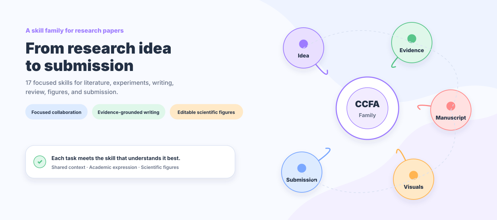
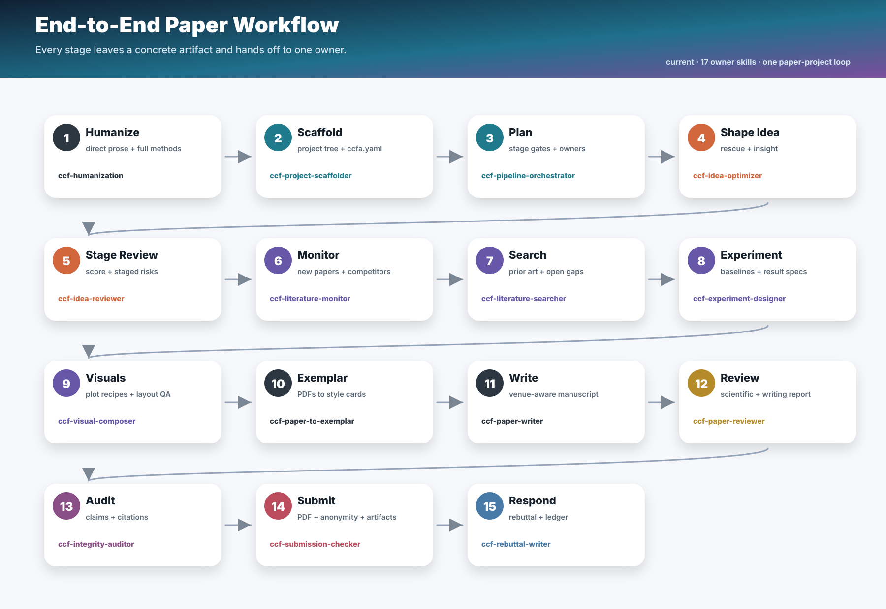

<div align="center">

<h1>CCFA Skills</h1>

**A skill family for shaping the research storyline of CCF-A papers.**

[Simplified Chinese](README.md) · [English](README.en.md) · [Traditional Chinese](README.zh-TW.md)


---

*“The structure of the prose becomes the structure of the scientific argument.”*<br>
George D. Gopen and Judith A. Swan, [*The Science of Scientific Writing*](https://www.cs.tufts.edu/comp/150FP/archive/george-gopen/sci.html)

*“The very process of science is centered around communication.”*<br>
Yann LeCun and James M. Manyika, [*Learning Abstractions*](https://www.amacad.org/publication/daedalus/learning-abstractions-conversation-yann-lecun)

</div>

## Table of contents

- [Quick start](#quick-start)
- [Why a family of skills](#why-a-family-of-skills)
- [The family and its 17 core skills](#the-family)
- [From idea to submission](#from-idea-to-submission)
- [Visual examples](#visual-examples)
- [Keeping the writing natural](#keeping-the-writing-natural)
- [Figures that remain editable](#figures-that-remain-editable)
- [Distinct roles, shared story](#distinct-roles-shared-story)
- [Repository and maintenance](#repository)
- [Star history](#star-history)

At two in the morning, the experiment finally finishes. The new result is better than expected, yet reopening the manuscript reveals the harder problem. The sharp question that began the project is buried beneath related work. The method section no longer quite matches the mechanism in the code. A new experiment answers the previous review, but pulls the argument in another direction. Every part seems to have improved, while the paper as a whole has become less clear.

Many promising projects are weakened not by a poor idea, but by what happens to that idea over time. Literature accumulates, result tables expand, and the author repeatedly switches between researcher, writer, and reviewer. The original insight gradually disappears beneath local revisions. One long prompt cannot reliably preserve all these relationships because retrieval must remain faithful to sources, experiments to protocols, writing to the argument, and review to independent judgment.

CCFA Skills grew from this problem. We treat a paper as a research storyline that must remain coherent while it changes, not as a document waiting to be filled. Seventeen specialized skills accompany the work from idea, literature, and experiments to writing, visualization, review, rebuttal, and submission. As the work passes between them, the link between question, evidence, and conclusion remains intact, so the paper can evolve without forgetting why it deserved to be written.

<p align="center">
  
</p>

## Quick start

**ICLR 2027 adaptation (2026-09-16)**: updated anonymity, page-budget, year-specific template, and AI-use disclosure checks against official guidance. Reviews focus on decision-relevant evidence and concerns within the existing fixed report structure. [Details](ccf-paper-writer/references/venue-guides/iclr.md) · [Changelog](CHANGELOG.md). Version remains `0.10.0`.

Choose the agent you use:

[Codex](docs/getting-started/CODEX.md) · [Claude Code](docs/getting-started/CLAUDE_CODE.md) · [Cursor](docs/getting-started/CURSOR.md) · [Gemini CLI](docs/getting-started/GEMINI_CLI.md) · [Other agents](docs/getting-started/OTHER_AGENTS.md) · [Automatic updates](docs/getting-started/AUTO_UPDATE.md)

One-line installation for Codex:

```powershell
npx skills add mikubaka88/CCFA-Skills --global --agent codex --skill '*' --yes --copy
```

Then describe the research problem in ordinary language:

```text
Review and rank these three ideas, and identify the most likely rejection reason for each.
Find recent work, benchmarks, and published baselines for temporal visual reasoning.
Design the main experiments, ablations, and robustness evidence for this paper without inventing results.
Rewrite the method section in a CVPR style while preserving equations, terminology, and citations.
Draw the method architecture, create an aesthetic draft first, and then ask whether to rebuild it as PPTX.
```

## Why a family of skills

The difficulties of paper research are connected, but they do not require the same kind of reasoning.

| What researchers encounter | How CCFA Skills responds |
|---|---|
| Retrieval, experiments, writing, and review compete inside one conversation | The skill best suited to the current question leads; adjacent capabilities join only when useful |
| Literature facts, experimental values, and manuscript claims drift apart | Sources, experiment design, and whole-paper consistency remain distinct responsibilities |
| A revision begins to sound like a review response full of caveats and internal status language | Writing forms the argument; Humanization restores direct and natural academic prose |
| Each review round changes its focus, obscuring whether the manuscript actually improved | Current publication readiness and progress over the previous version are considered separately |
| Architecture figures are either plain box diagrams or attractive but impossible to edit | A content-aware visual draft comes first, followed by optional SVG, PDF, or PPTX reconstruction |
| More installed skills create more noise instead of better work | Only capabilities relevant to the present question enter the conversation |

## What we value

- **The research question comes before the tool.** Judging an idea is different from developing it. Designing evidence is different from drawing a figure. Each step remains centered on the question it must answer.
- **Evidence keeps its provenance.** Literature, protocols, values, claims, figures, and citations do not collapse into plausible prose. A missing fact stays missing until it is found or verified.
- **A paper should sound academic, not defensive.** Humanization removes ritual caveats, mechanical enumeration, excessive em dashes, and internal process language while preserving material limitations and disclosures.
- **Review remains independent from revision.** The Reviewer judges; the Writer revises. Diagnosis comes before repair, so the manuscript does not argue with its own evaluation.
- **Scientific figures should explain and invite attention.** Quantitative plots remain reproducible. Method figures first explore a visual language suited to their content, then become editable when the user chooses.
- **Exemplars provide direction rather than a template.** When users supply target papers, CCFA learns their narrative rhythm, paragraph roles, and evidence organization without copying sentences or forcing one style onto every project.

## The family


Every CCFA task activates `ccf-humanization` first, then `ccf-common`, before the specialist, including retrieval, review, visuals, experiments, and maintenance. Humanization keeps communication direct and evidence-faithful; Common applies scope, collaboration, evidence, and file rules. Reuse active rules across contributors and refresh only changed or missing context. Detailed rewriting and experiment checks depend on the actual task, without duplicate preflight reports. Specialists retain ownership and integrate necessary contributions.

### The 17 core skills

| Research moment | Skill | What it contributes |
|---|---|---|
| Family coordination | `ccf-common` | Understands requests, coordinates responsibilities, and protects evidence and privacy boundaries |
| Project direction | `ccf-pipeline-orchestrator` | Clarifies goals, stages, decisive milestones, and the next move |
| Project beginning | `ccf-project-scaffolder` | Prepares the paper workspace, templates, and research-material structure |
| Idea judgment | `ccf-idea-reviewer` | Judges idea value, novelty, and mechanism; excludes experiments by default |
| Idea development | `ccf-idea-optimizer` | Turns a rough direction into a problem, insight, method, and evidence path |
| Literature search | `ccf-literature-searcher` | Finds related work, datasets, benchmarks, and published baselines |
| Frontier tracking | `ccf-literature-monitor` | Watches new papers, nearby work, and changes in the field |
| Experiment design | `ccf-experiment-designer` | Designs main comparisons, ablations, robustness studies, and result structures |
| Integrity | `ccf-integrity-auditor` | Checks claims, values, terminology, figures, and citations together |
| Paper review | `ccf-paper-reviewer` | Provides independent scientific review, version comparison, and readiness judgment |
| Paper writing | `ccf-paper-writer` | Drafts, rewrites, polishes, and compresses manuscript text |
| Academic voice | `ccf-humanization` | Removes defensive and mechanical prose without weakening rigor |
| Author response | `ccf-rebuttal-writer` | Organizes rebuttals, response letters, and revision records |
| Scientific visuals | `ccf-visual-composer` | Creates plots, visual tables, method figures, and editable versions |
| Submission | `ccf-submission-checker` | Checks templates, page limits, anonymity, PDFs, and supplementary material |
| Exemplar learning | `ccf-paper-to-exemplar` | Distills controllable writing patterns from papers supplied by the user |
| Family maintenance | `ccf-skill-forger` | Improves skills, resolves conflicts, and validates releases |

The complete responsibility map:


## From idea to submission



This is not a pipeline that everyone must enter at the beginning. You may arrive with a half-formed idea, a result table that resists interpretation, a method reviewers repeatedly misunderstand, or a PDF that is nearly ready to submit. CCFA Skills begins where you are and brings in only the help that matters there.

## Visual examples

These are research visuals rather than release-announcement graphics. Each figure uses a visual language suited to its reading context.

### Paper method architecture

The figure below extracts the computational relationships from `output/DynTrace.pdf` and uses a layered layout to explain the mechanism and information flow. Inputs and visual processing sit at the bottom, geometry-grounded evidence and the DTV/DTG branches form the middle, and token integration, the MLLM, and the answer appear at the top. Connections follow computational dependencies so readers can trace the complete method.


**How it was made:** The DynTrace paper was distilled into mechanism relationships and representation–operation pairs. GPT Image 2 then generated a layered architecture draft, followed by a check that the method remained complete. The displayed artifact is a PNG visual draft; after composition approval, it can be rebuilt as semantic SVG, vector PDF, or native-object PPTX.

<details>
<summary>Reference figure, source, and composition principles</summary>


Reference: Hanyu Zhou and Gim Hee Lee, [*LLaVA-4D: Embedding SpatioTemporal Prompt into LMMs for 4D Scene Understanding*](https://arxiv.org/abs/2505.12253), Figure 2; see also the [OpenReview page](https://openreview.net/forum?id=URpbmVEsqB). The screenshot is included only for non-commercial study of academic composition and visual style. Copyright remains with the authors; please contact the maintainer for removal if it raises any rights concern.

- A paper figure should make its inputs, representations, operations, branches, integration, and output easy to follow.
- Video frames, optical flow, masks, 3D trajectories, DT-Tokens, and the temporal graph carry method meaning rather than decoration.
- Ordinary English uses natural capitalization; Qwen3-VL, WAFT, SAM3, DTV, DTG, MLLM, 3D, and 4D retain their canonical forms.

</details>

### PPT/Poster

The two earlier visual explorations remain below. They are better suited to slides, project posters, and README overviews, so they are not presented as top-conference method figures.

#### GPT Image 2 concept draft


**How it was made:** The three-stage DynTrace method was translated into a vivid visual story built around video, trajectories, and graph structure, then explored with GPT Image 2.

#### Reference-guided PPT/Poster


**How it was made:** Reference composition principles were added to the three-stage content so that headings, color fields, and visual anchors would read naturally in a presentation or poster.

### Data-analysis figures

The following figures come from reproducible `ccf-visual-composer` drawing recipes. Their values demonstrate visual forms and are not reported paper findings.

| Composite figure | Heatmap |
|---|---|
|  |  |
| **Volcano plot** | **Bar chart** |
|  |  |
| **Slopegraph** | **Radial chart** |
|  |  |

More examples are available in [`assets/visual-showcase/`](assets/visual-showcase/).

## Keeping the writing natural

`ccf-paper-writer` can learn from exemplars chosen by the user. It studies how an effective paper frames its problem, unfolds its method, arranges evidence, and controls pace. It does not copy source sentences or turn one paper into a template for every field.

`ccf-humanization` checks what scientific information each sentence contributes: state supported facts directly, qualify genuine uncertainty accurately, and delete empty defenses. It removes imagined reviewer objections, apologies for the contribution, repeated caveats, ritual endings, and internal status narration. Paragraphs do not need an appended limitation or future-work sentence. Observed failures, scope conditions, reproducibility details, and required disclosures remain visible; only concrete unresolved scientific decisions need a separate warning.

Route by the requested judgment: “Is this direction worth pursuing?” uses `ccf-idea-reviewer` without needing an explicit score request; “Does this manuscript support its conclusions?” uses `ccf-paper-reviewer`. A full PDF can still receive concept-only review. Idea ratings cover problem value, novelty, insight, mechanism, elegance, and audience fit; experiments are assessed separately only when requested.

Structured review reports use detailed output by default and brief output on explicit request. Manuscript reports develop contributions, strengths, concerns, prior art, method and evidence, reviewer perspectives, ratings, and action priorities. Idea reports develop problem value, novelty, mechanism logic, and development advice; experiments are outside their default scope. Findings carry specific evidence locations and stable IDs for revision tracking. Percentile ranks require a real comparable corpus. See the [manuscript report format](ccf-paper-reviewer/references/fixed-output-format.md) and [idea-review protocol](ccf-idea-reviewer/references/strict-idea-review.md).

Full manuscript reviews keep 14 ordered sections, writing reviews keep 9, and explicitly requested brief reports use 5 blocks. The generic scientific scorecard has seven criteria: novelty, soundness, evidence, significance, clarity, reproducibility, and ethics/limitations. Evidence expectations follow contribution type; confidence and source coverage are separate. Markdown reports can be checked directly for section order, rating fields, and concern-ID references. Explicit venue or user formats retain priority.

Manuscript re-review answers two different questions:


- **Is the current manuscript ready for its target venue?** This measures the remaining distance to the publication standard.
- **Did the revision make genuine progress?** This compares what the new version resolved and what new problems it may have introduced.

## Figures that remain editable


Quantitative figures begin with reproducible code and traceable data. Method, system, and architecture figures usually begin with GPT Image 2 exploring a visual language that suits the content. Requested editable SVG, vector PDF, or PPTX deliverables continue under the existing authorization; additional formats can be offered when useful. Existing editable figures are revised in their authoring source, with only affected exports rebuilt; local text, color, spacing, value, or format changes do not restart image generation. Common concepts use a coherent open-source icon family, while method-specific scientific objects can be drawn together in the initial draft and isolated as assets when reuse or editing requires it. In PPTX, text, boxes, nodes, and connectors remain native objects wherever possible, so the final figure can still be meaningfully revised.

Figure aspect ratio follows the content and paper placement, with no default square. Allocate space to the main mechanism before placing compact modules, illustrations, and connectors. Align peer edges, text baselines, and ports across groups, and inspect unused regions. Set a consistent type scale at final paper width: Times New Roman by default, or Comic Sans MS for a requested comic treatment. Keep essential scientific labels while removing repeated explanation and ornamental numbers.

Five coordinated presets cover formal mechanisms, soft mechanisms, visual evidence, geometric flows, and compact comic illustrations, alongside seven additional palettes. Venue context helps select a preset; actual template requirements take precedence. These are design suggestions, not official conference styles. Each preset coordinates type, strokes, grouping, and color, while each reference has a specific region or property to guide. Pixel gaps are generation targets; requested editable outputs enforce live fonts and coordinates. Local edits check attached connectors and protected regions, with current artifacts organized per figure.

When a user does not want GPT Image 2 or explicitly prefers code-first drawing, `ccf-visual-composer` uses a pure-SVG route and labels it clearly.

## Distinct roles, shared story


Each artifact has an owner responsible for integration and delivery. Other skills contribute according to prerequisites and quality needs; role boundaries support necessary collaboration:

| Your request | Responsible skill | What it deliberately avoids |
|---|---|---|
| Is this idea worthwhile, novel, or coherent? Score or compare ideas | `ccf-idea-reviewer` | Concept review by default; missing experiments do not lower its score |
| Develop one rough idea | `ccf-idea-optimizer` | Does not make ranking its primary goal |
| Find benchmarks and published results | `ccf-literature-searcher` | Does not invent an experiment conclusion |
| Choose baselines, metrics, and ablations | `ccf-experiment-designer` | Does not alter or fabricate results |
| Review, score, and diagnose | `ccf-paper-reviewer` | Does not rewrite the manuscript while judging it |
| Rewrite, polish, and compress | `ccf-paper-writer` | Does not change the scientific problem, method, or conclusion without authorization |
| Draw figures, tables, and PPTX | `ccf-visual-composer` | Does not choose datasets, metrics, or values |

## Repository

```text
CCFA-Skills/
├── ccf-common/                 # Shared family guidance
├── ccf-*/SKILL.md              # Entry points for 17 skills
├── ccf-*/references/           # References read when needed
├── ccf-*/scripts/              # Reproducible operations
├── assets/                     # README visuals and figure examples
├── evaluation/                 # Regression and ablation results
├── tools/build_ccfa_diagrams.py
└── 实验结果.md
```

Longer guidance lives in `references/`, while repeatable work belongs in `scripts/`. Iterative artifacts keep stable names so that a new version replaces the previous one instead of leaving behind a trail of indistinguishable attempts.

Work backward from the result to its prerequisites: closest-work evidence before novelty judgments, claims and citation support before substantive writing, and data semantics/topology before scientific rendering. Use the relevant skills to resolve missing, conflicting, or stale evidence; reuse valid checks. Verify affected arguments after substantial revisions and integrate fixes before delivery. Concept review still does not require completed experiments. Internal contributions return focused findings; requested reviews retain their fixed templates and full scoped coverage. Save tokens on repeated retrieval, duplicate reports, irrelevant references, and repeated intake, while completing necessary groundwork. See [cooperation routes](ccf-common/references/routing.md) and [handoff rules](ccf-common/references/handoff-modes.md).

The file contract leads all 17 skill entrypoints. Explicit paths, this artifact's existing mappings, and established task folders take priority. New tasks use a dedicated project-root `ccfa-workfiles/<purpose>/<artifact-id>/`, outside generic `output/` folders. Examples include `figures/method-overview/`, `reviews/paper-short-title/`, and `literature/retrieval-memory/`. If the name belongs to unrelated material, use a stable `ccfa-workfiles-<project-id>/` rather than merging or overwriting contents.

Create `source/` (reusable authoring files), `assets/` (reference/icon assets), `cache/` (downloads/extractions), and `build/` (current previews/logs) only when needed. Skills working on the same artifact share its directory and update current files. Avoid ambiguous new names such as `temp`, `misc`, or `final-final`. Remove only verified disposable files created by the task; retain original evidence, editable sources, requested outputs, and necessary comparison baselines. Failed builds preserve usable results. Existing folders are not migrated to adopt the new default; see the [artifact contract](ccf-common/references/artifact-contracts.md).

Chinese output uses explicit UTF-8 I/O with optional BOM support on input. Shell pipes, Unicode filenames, and glyph coverage are checked separately. Family validation includes Chinese and uncommon-character regressions and reports decoding errors rather than masking them with replacement characters. Figures retain the chosen Latin font and use an available CJK fallback.

## Maintenance and validation

```powershell
python ccf-common\scripts\check_v04.py
python ccf-common\scripts\check_path_privacy.py
python ccf-common\scripts\check_markdown_links.py
python ccf-common\scripts\check_sources.py
```

These checks confirm that all 17 skills can be discovered, their responsibilities remain clear, documentation links resolve, and public files contain no machine-specific paths or private information. Experiment and efficiency results are summarized in [实验结果.md](实验结果.md).

`0.10.0` validates instructions, structure, and script behavior; historical experiments do not measure GPT-6 token or quality gains.

## Commitments

- Never invent experimental results, citations, method components, or venue rules.
- Read only the private manuscript or unpublished material needed for the task.
- Use external retrieval and image generation with user authorization and minimal disclosure.
- Respect the user's decision to disable any skill.
- Explain the rubric, comparison target, evidence, and uncertainty behind every automated score.

## Acknowledgments

Thanks to [Research-Paper-Writing-Skills](https://github.com/Master-cai/Research-Paper-Writing-Skills) for contributing to the open ecosystem of academic-writing skills.

## Star history

[](https://github.com/mikubaka88/CCFA-Skills/stargazers)

<a href="https://www.star-history.com/?repos=mikubaka88%2FCCFA-Skills&amp;type=date">
  <picture>
    <source media="(prefers-color-scheme: dark)" srcset="https://api.star-history.com/svg?repos=mikubaka88/CCFA-Skills&amp;type=Date&amp;theme=dark" />
    <source media="(prefers-color-scheme: light)" srcset="https://api.star-history.com/svg?repos=mikubaka88/CCFA-Skills&amp;type=Date" />
    
  </picture>
</a>

The chart updates through Star History and the count badge through Shields.io. Service and GitHub image caches can delay changes; the chart is typically cached for about 24 hours, so it is not a second-by-second live feed. Click the chart for the interactive page.

[View the 2026-08-13 historical snapshot (available offline)](assets/ccfa-skills-star-history.svg)
