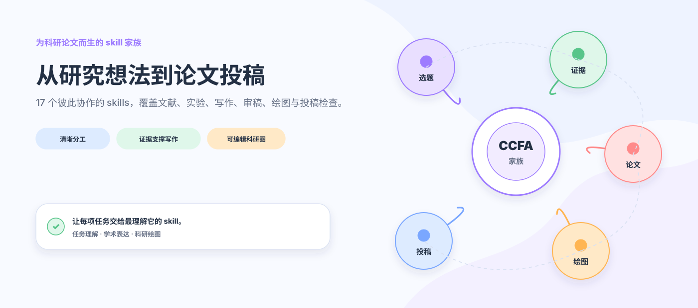
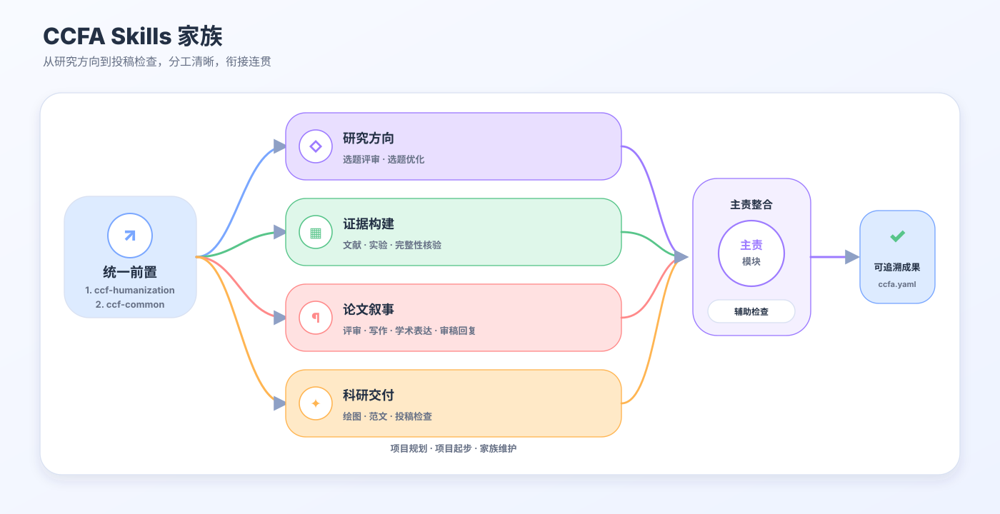
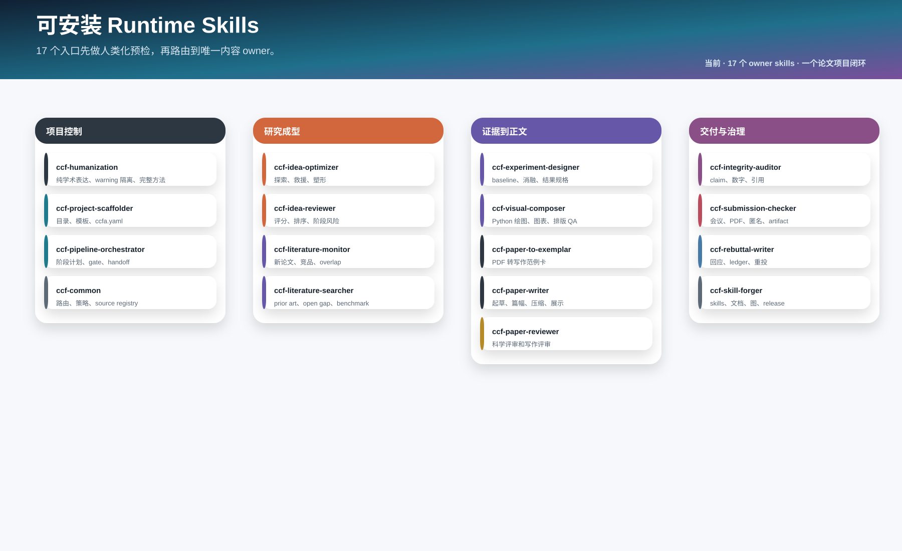
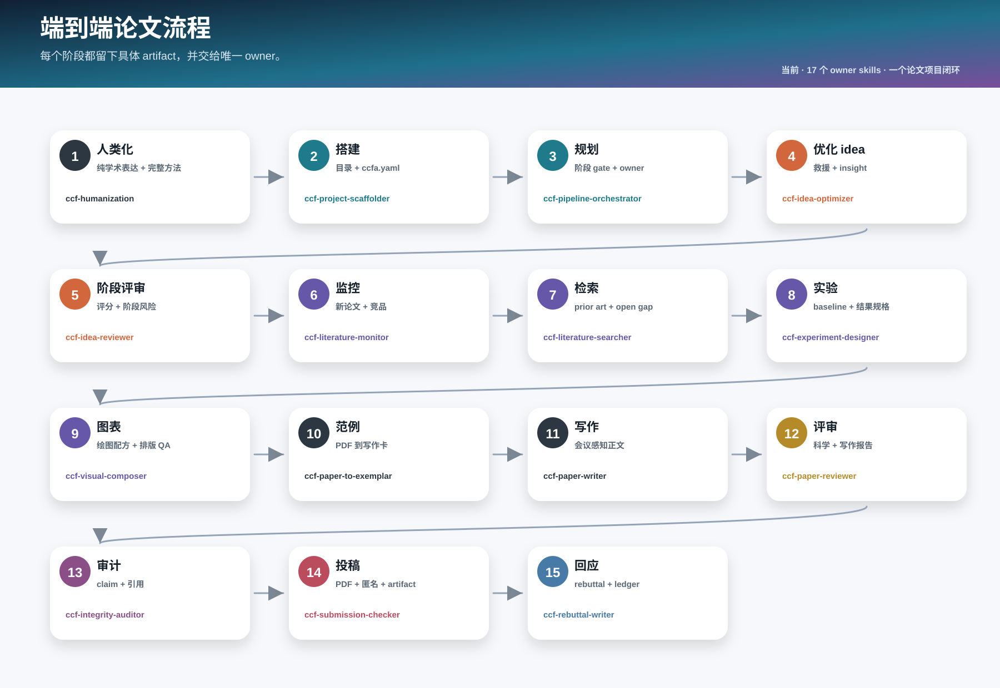
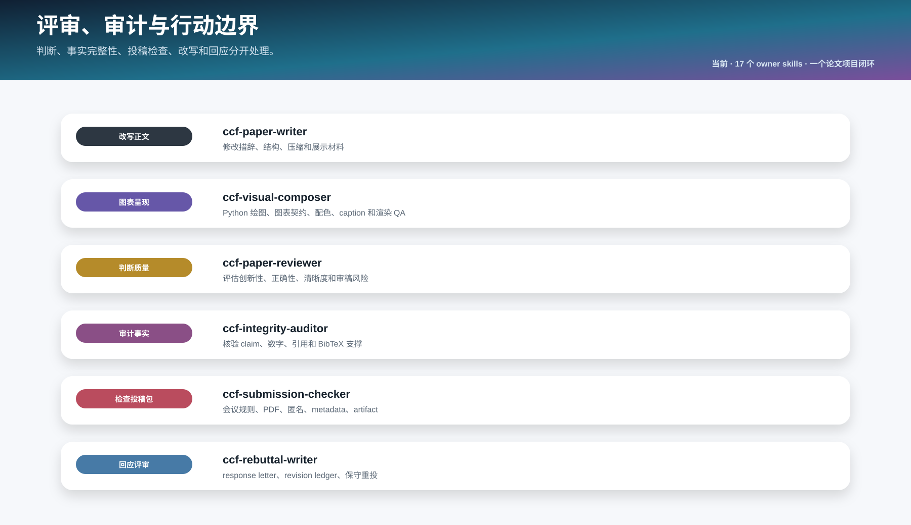
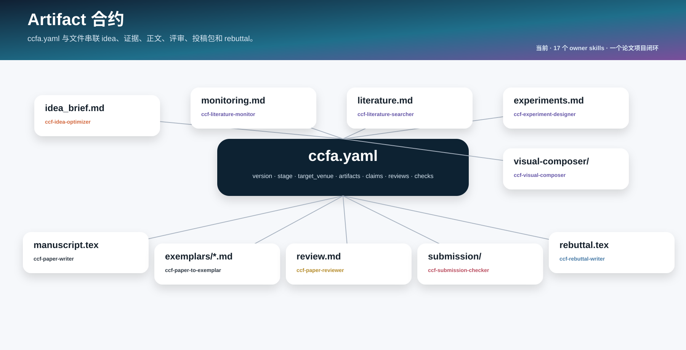
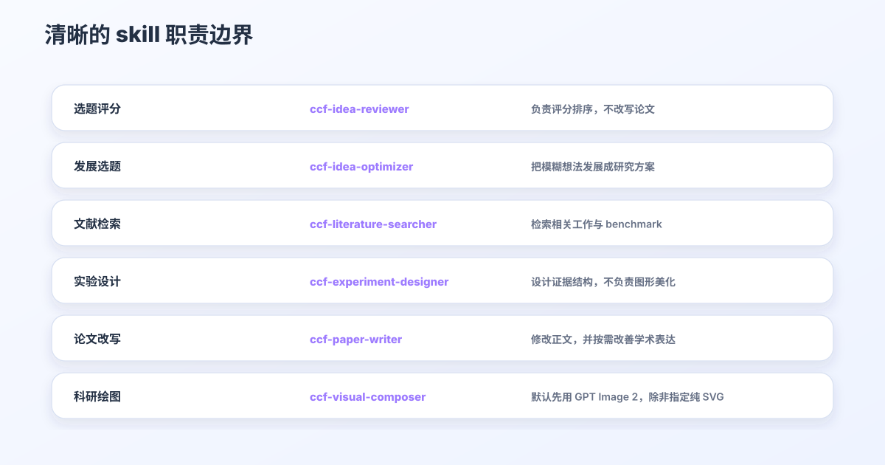

<div align="center">

<h1>CCFA Skills</h1>

**A skill family for shaping the research storyline of CCF-A papers.**

[简体中文](README.md) · [English](README.en.md) · [繁體中文](README.zh-TW.md)


---

*“The structure of the prose becomes the structure of the scientific argument.”*<br>
George D. Gopen and Judith A. Swan, [*The Science of Scientific Writing*](https://www.cs.tufts.edu/comp/150FP/archive/george-gopen/sci.html)

*“The very process of science is centered around communication.”*<br>
Yann LeCun and James M. Manyika, [*Learning Abstractions*](https://www.amacad.org/publication/daedalus/learning-abstractions-conversation-yann-lecun)

</div>

## 目录

- [快速开始](#快速开始)
- [为什么需要一个 skill 家族](#为什么需要一个-skill-家族)
- [家族架构与核心 skills](#家族架构)
- [从 idea 到投稿](#从-idea-到投稿)
- [绘图示例](#绘图示例)
- [写作如何保持自然](#写作如何保持自然)
- [让图既好看，也能继续修改](#让图既好看也能继续修改)
- [各司其职，彼此接力](#各司其职彼此接力)
- [安装、维护与验证](#仓库结构)
- [Star 旅程](#star-旅程)

凌晨两点，实验终于结束，新的结果比预期更好。可是重新打开稿件时，真正棘手的问题才显现出来：最初那个清晰而有力的研究问题已经埋进冗长的 related work，方法描述与代码中的实际机制出现偏差；新补的实验回应了上一轮审稿意见，却让论证分成几条彼此疏离的线索。每个局部似乎都更完善了，整篇论文反而更难读懂。

许多有潜力的研究最终未能充分展现价值，并不是因为 idea 不够好，而是因为它在漫长的推进中逐渐失去了清晰的轮廓。文献越积越多，实验表格不断扩张，作者还要在研究、写作和审稿视角之间反复切换。一个无所不包的长 prompt 很难同时做好这些事情，因为检索需要忠于来源，实验需要遵循协议，写作需要围绕论证展开，审稿则必须保持独立判断。

我们因此设计了 CCFA Skills。论文不是等待逐项填充的文档，而是一条需要在反复修改中保持连贯的研究故事线。17 个分工明确的 skills 从 idea、文献和实验出发，帮助论证逐渐成形，并贯穿写作、绘图、评审、rebuttal 与投稿。当任务从一个 skill 交给另一个 skill 时，研究问题、证据和结论之间的联系仍然会被保留下来。

<p align="center">
  
</p>

## 快速开始

**ICLR 2027 适配更新（2026-09-16）**：按官方指南校准匿名、页数、年份模板和 AI 使用声明检查；评审聚焦影响结论的证据与问题，沿用固定报告结构。[适配细节](ccf-paper-writer/references/venue-guides/iclr.md) · [更新记录](CHANGELOG.md)。版本仍为 `0.10.0`。

选择你正在使用的 Agent：

[Codex 安装](docs/getting-started/CODEX.md) · [Claude Code 安装](docs/getting-started/CLAUDE_CODE.md) · [Cursor 安装](docs/getting-started/CURSOR.md) · [Gemini CLI 安装](docs/getting-started/GEMINI_CLI.md) · [其他 Agent](docs/getting-started/OTHER_AGENTS.md) · [自动更新](docs/getting-started/AUTO_UPDATE.md)

在 Codex 中一行安装：

```powershell
npx skills add mikubaka88/CCFA-Skills --global --agent codex --skill '*' --yes --copy
```

安装后，直接说出你正在面对的研究问题：

```text
严格评审这三个选题并排序，指出各自最可能被拒的原因。
检索近三年与时序视觉推理相关的工作、benchmark 和公开 baseline。
根据这篇论文设计主实验、消融和鲁棒性证据，不要虚构结果。
把方法部分改写为 CVPR 风格，并保留公式、术语和引用。
根据论文绘制方法架构图，先生成审美稿，再询问是否重建为 PPTX。
```

## 为什么需要一个 skill 家族

论文研究中的困难彼此相连，却不能由同一种思维方式解决。

| 研究者遇到的困境 | CCFA Skills 如何回应 |
|---|---|
| 检索、实验、写作和审稿挤在同一次对话中，彼此干扰 | 由最适合当前任务的 skill 负责，其他能力按需协助 |
| 文献事实、实验数字和正文结论逐渐脱节 | 分别核对来源、实验设计与全文一致性，让每个 claim 都能找到证据 |
| 论文越改越像审稿回复，充满防御、解释和内部状态 | 写作负责形成正文，Humanization 让语言回到自然、直接的学术表达 |
| 新一轮评审不断更换关注点，难以判断修订是否真正进步 | 同时观察当前稿件的录用准备度与相对上一版的实际改进 |
| 架构图要么只是方框流程，要么漂亮却无法继续编辑 | 先探索适合内容的视觉语言，再按需要重建为 SVG、PDF 或 PPTX |
| 加载的 skills 越多，结果反而越容易受到无关规则干扰 | 只加载与当前问题直接相关的能力，减少无关上下文 |

## 我们珍视什么

- **让研究问题先于工具。** 评价一个 idea 与发展一个 idea 是两种工作；设计实验与美化图表也需要不同的判断。CCFA Skills 让每一步都回到它真正要回答的问题。
- **让证据始终有据可查。** 文献、实验协议、数值、结论、图表和引用不会被混成一团。缺失的事实保持缺失，直到它被可靠地找到或验证。
- **让论文听起来像学术，而不是辩护。** Humanization 删除防御性铺垫、机械枚举、过度破折号和内部工程措辞，同时保留真正影响结论的限制、证据与披露。
- **让评审保持独立。** Reviewer 负责判断，Writer 负责修改。先看问题，再决定如何改，避免一边审稿一边替自己解释。
- **让科研图表达清楚，也足够美观。** 数值图保持可复现；方法图先寻找与内容相称的构图，再由用户决定是否转成可编辑版本。
- **让范文成为方向，而不是模板。** 用户提供目标论文后，系统学习它的叙事节奏、段落职责和证据组织，但不复制原句，也不把一种写法强加给所有研究。

## 家族架构



所有 CCFA 任务都先启用 `ccf-humanization`，再启用 `ccf-common`，然后进入具体技能；检索、评审、绘图、实验与维护也遵循这一顺序。前者统一自然、直接且保留真实证据的表达，后者落实协作、范围、证据和文件规则。同一任务交接时复用已生效规则，只刷新变化或丢失的部分；详细改写与实验检查按实际任务执行，不重复生成前置报告。各技能继续负责自己的产物并整合必要协作。

### 17 个核心 skills

| 研究阶段 | Skill | 它能带来什么 |
|---|---|---|
| 家族协调 | `ccf-common` | 理解请求，协调分工，统一证据与隐私规则 |
| 项目推进 | `ccf-pipeline-orchestrator` | 梳理目标、阶段、关键节点与下一步 |
| 项目起步 | `ccf-project-scaffolder` | 准备论文目录、模板与研究材料空间 |
| 选题判断 | `ccf-idea-reviewer` | 判断思路价值、创新与机制逻辑，默认不审核实验 |
| 选题发展 | `ccf-idea-optimizer` | 把模糊方向发展成问题、洞察、方法与证据路径 |
| 文献检索 | `ccf-literature-searcher` | 寻找相关工作、数据集、benchmark 与公开 baseline |
| 前沿追踪 | `ccf-literature-monitor` | 关注新论文、相近工作与研究方向的最新变化 |
| 实验设计 | `ccf-experiment-designer` | 设计主实验、消融、鲁棒性分析与结果表结构 |
| 完整性核验 | `ccf-integrity-auditor` | 核对 claim、数值、术语、图表和引用 |
| 论文评审 | `ccf-paper-reviewer` | 给出独立科学评审、版本比较与录用准备度判断 |
| 论文写作 | `ccf-paper-writer` | 起草、改写、润色与压缩论文内容 |
| 学术表达 | `ccf-humanization` | 去除防御性和机械感，保留自然严谨的学术表达 |
| 审稿回复 | `ccf-rebuttal-writer` | 组织 rebuttal、response letter 与修订记录 |
| 科研绘图 | `ccf-visual-composer` | 生成数值图、视觉表格、方法图及可编辑版本 |
| 投稿检查 | `ccf-submission-checker` | 检查模板、页数、匿名、PDF 与补充材料 |
| 范文学习 | `ccf-paper-to-exemplar` | 从用户提供的论文中提炼可复用的写作方法 |
| 家族维护 | `ccf-skill-forger` | 改进 skills，消除冲突，完成发布前检查 |

完整职责视图：



## 从 idea 到投稿



这不是一条必须从头走到尾的流水线。你可以带着一个尚未成形的想法而来，也可以只带来一张难以解释的结果表、一段总被审稿人误解的方法，或一份即将提交的 PDF。CCFA Skills 会从你所在的位置开始，只调用真正有帮助的部分。

## 绘图示例

这里展示的是实际科研成图，而不是功能宣传图。不同图面向不同阅读场景，因此使用不同的构图语言。

### 论文方法架构图

下图从 `output/DynTrace.pdf` 中提取计算关系，以分层布局呈现方法机制与信息流。输入与视觉处理位于底部，几何证据和 DTV/DTG 分支构成中层，token 融合、MLLM 与答案位于顶部。各层按计算依赖连接，便于沿信息流阅读完整方法。


**成图方式：** 先从 DynTrace 论文中提炼机制关系，梳理每种表示及其对应操作，由 GPT Image 2 生成分层架构图，并核对方法信息是否完整。当前展示的是 PNG 视觉稿；构图确认后，可继续重建为 SVG、矢量 PDF 或由原生对象组成的 PPTX。

<details>
<summary>查看参考图、出处与构图原则</summary>


参考出处：Hanyu Zhou and Gim Hee Lee, [*LLaVA-4D: Embedding SpatioTemporal Prompt into LMMs for 4D Scene Understanding*](https://arxiv.org/abs/2505.12253), Figure 2；亦见 [OpenReview 页面](https://openreview.net/forum?id=URpbmVEsqB)。截图仅用于非商业的学术构图研究与风格说明，版权归原作者所有。如涉及侵权，请联系项目维护者删除。

- 论文图应当让输入、表示、操作、分支、融合与输出一目了然。
- 视频帧、光流、掩码、3D 轨迹、DT-Tokens 与 temporal graph 都承担方法含义，而不是装饰。
- 普通英语使用自然大小写；Qwen3-VL、WAFT、SAM3、DTV、DTG、MLLM、3D 与 4D 保持规范缩写。

</details>

### PPT/Poster

下面保留两张早期视觉探索。它们更适合演示文稿、项目海报或 README 概览，因此不作为顶会论文方法图示例。

#### GPT Image 2 概念稿


**成图方式：** 从 DynTrace 的三阶段方法出发，把视频、轨迹和图结构转化为鲜明的视觉叙事，再由 GPT Image 2 完成概念探索。

#### 参考驱动的 PPT/Poster


**成图方式：** 在三阶段内容之上加入参考构图原则，让标题、色块和视觉锚点更适合演示与海报阅读。

### 数据分析图

以下图形由 `ccf-visual-composer` 的可复现绘图方案生成。图中数值仅用于展示图形语言，不代表论文实验结论。

| 组合图 | 热图 |
|---|---|
|  |  |
| **火山图** | **柱状图** |
|  |  |
| **坡度图** | **径向图** |
|  |  |

更多示例位于 [`assets/visual-showcase/`](assets/visual-showcase/)。

## 写作如何保持自然

`ccf-paper-writer` 可以学习用户指定的范文。它关注优秀论文如何提出问题、展开方法、安排证据和控制节奏，但不会复制原句，也不会把某一篇论文变成所有研究的固定模板。

`ccf-humanization` 逐句判断表达承载了什么科学信息：有事实就直接陈述，有真实不确定性就准确限定，没有信息的自辩直接删除。它清理审稿人预判、贡献自我降格、重复 caveat、机械结尾和内部版本旁白，不再要求每段补局限性或未来工作。实际失败、适用条件、复现信息与必要披露仍保留；仅对证据无法解决的具体科研决策单独提醒。

思路审核与文章审核按判断对象区分：“这个方向值得做吗”由 `ccf-idea-reviewer` 处理，无需指定评分；“稿件结论是否站得住”由 `ccf-paper-reviewer` 处理。即使输入完整 PDF，只看核心思路的请求也保持概念审核。思路评分聚焦问题、创新、洞察、机制、简洁性与受众价值，实验仅在明确要求时单独评估。

结构化审核报告默认输出详细版，明确要求简要时使用简要版。文章审核展开贡献、优缺点、相关工作、方法与证据、多视角意见、评分及修改优先级；思路审核展开问题价值、创新差异、机制逻辑与发展建议，默认不评实验。意见绑定具体位置、依据与稳定编号，复审追踪问题是否解决；不会生成缺乏真实参照集的百分位排名。详见[文章报告模板](ccf-paper-reviewer/references/fixed-output-format.md)与[思路审核协议](ccf-idea-reviewer/references/strict-idea-review.md)。

完整文章评审固定 14 节，写作专项固定 9 节，明确要求简版时使用 5 块。通用科学评分统一为新颖性、正确性、证据、意义、清晰度、可复核性、伦理与局限七维；证据要求按贡献类型解释，置信度与材料覆盖范围分开。生成报告可直接检查 Markdown 的标题顺序、评分字段和问题编号引用；会议或用户明确指定的格式继续优先。

文章复审同时回答两个不同的问题：



- **当前稿件是否足以投稿。** 它衡量论文距离目标 venue 的录用标准还有多远。
- **这次修订是否真正进步。** 它比较新旧版本解决了什么，又是否引入了新的问题。

## 让图既好看，也能继续修改



数值图优先来自可复现代码和可追溯数据。新的方法图、系统图与架构图通常先由 GPT Image 2 探索与内容相称的视觉语言，用户已要求的可编辑 SVG、矢量 PDF 或 PPTX 会继续完成。已有可编辑图的文字、颜色、间距、数值或导出修改直接更新源文件，并只重新导出受影响的格式。常见概念使用风格统一的开源图标，方法特有的科学对象可在初稿中统一绘制，需要复用或编辑时再单独整理为资产。进入 PPTX 后，文字、框、节点与连接线尽量保留为原生对象，使最终成图能够真正修改。

绘图按内容与论文版面选择画布比例，不默认方形。先确定整体分区和重点机制，再安排紧凑的模块、图标与连线路径；同类模块跨区域对齐边缘、文字基线和连接端口，并检查大块无效留白。字体按最终论文宽度统一分级，默认 Times New Roman，需要 comic 效果时使用 Comic Sans MS；保留必要科学标注，减少重复解释和装饰性数字。

可选预设包括正式机制、柔和机制、视觉证据、几何流与紧凑漫画，配合七套扩展配色。会议场景帮助选择预设，实际模板要求优先；这些是设计建议，不是会议官方风格。预设同时协调字体、线宽、分组和颜色，参考图各自负责明确的区域或属性。像素间距是生成目标，精确坐标和真实字体在已要求的可编辑版本中校准。局部修改检查关联连线和未修改区域，中间文件仍按图归档并更新当前版本。

如果用户明确不使用 GPT Image 2，或希望直接从代码生成，`ccf-visual-composer` 会改用纯 SVG 路线并清楚标注。

## 各司其职，彼此接力



每个产物有一位负责整合与交付的主责技能，其他技能按前置依赖和质量需要参与。分工不限制必要协作：

| 你的请求 | 负责的 Skill | 明确不负责 |
|---|---|---|
| 思路靠谱吗、值得做吗、创新够不够、评分排序 | `ccf-idea-reviewer` | 默认只审概念，不因缺少实验扣分 |
| 发展一个模糊 idea | `ccf-idea-optimizer` | 不把排名当成主要目标 |
| 搜 benchmark 与公开结果 | `ccf-literature-searcher` | 不替实验结果作结论 |
| 设计 baseline、指标与消融 | `ccf-experiment-designer` | 不改动或虚构结果 |
| 评审、评分与诊断 | `ccf-paper-reviewer` | 不在评审过程中改写正文 |
| 改写、润色与压缩 | `ccf-paper-writer` | 不擅自改变研究问题、方法和结论 |
| 绘制图表与 PPTX | `ccf-visual-composer` | 不选择数据集、指标或数字 |

## 仓库结构

```text
CCFA-Skills/
├── ccf-common/                 # 家族共享规则
├── ccf-*/SKILL.md              # 17 个 skill 入口
├── ccf-*/references/           # 按需阅读的参考资料
├── ccf-*/scripts/              # 可复现操作
├── assets/                     # README 图片与绘图示例
├── evaluation/                 # 回归与消融结果
├── tools/build_ccfa_diagrams.py
└── 实验结果.md
```

较长的规则放在 `references/`，可重复执行的操作放在 `scripts/`。迭代过程中沿用固定文件名，由新版本覆盖旧版本，避免堆积难以辨认的过程文件。

协作从最终结果倒推前置条件：判断创新性前核对近邻工作，实质性写作前厘清主张、证据和引用，科学绘图前确认数据含义与方法结构。缺失、冲突或过期的依据交给相应技能补齐；已有且仍适用的证据直接复用。实质性改写后检查受影响的论证，解决问题后再交付；思路审核仍不要求实验完成。内部协作返回相关发现，正式审稿保留固定模板和必要的全文覆盖。节省 token 的重点是重复检索、重复报告、无关参考和重复询问，不是省略前置工作。详见[协作路由](ccf-common/references/routing.md)与[交接规则](ccf-common/references/handoff-modes.md)。

文件约束已前置到全部 17 个 skill 入口。中间文件优先沿用用户指定路径、该产物的 `ccfa.yaml` 映射和已有任务目录；新任务使用项目根目录下独立的 `ccfa-workfiles/<任务用途>/<具体产物>/`，不嵌套在通用 `output/` 中。例如 `figures/method-overview/`、`reviews/paper-short-title/`、`literature/retrieval-memory/` 分别存放方法图、论文评审和主题检索的工作文件。若同名目录已被其他用途占用，采用稳定的 `ccfa-workfiles-<项目名>/`，不混用或覆盖。

需要时才创建 `source/`（可复用源文件）、`assets/`（参考与图标）、`cache/`（下载与提取缓存）、`build/`（当前预览与构建日志）。同一产物跨 skill 共用目录，普通迭代更新原文件，不使用含义不明的 `temp`、`misc` 或 `final-final`。完成后清理本任务产生且已确认可丢弃的过程文件，保留原始数据、可编辑源文件、最终产物及必要对比证据；失败生成不覆盖可用结果。已有目录不因新命名规则被搬迁，完整规则见[产物合约](ccf-common/references/artifact-contracts.md)。

中文输出采用显式 UTF-8 读写，兼容带 BOM 的输入；终端管道、中文文件名和图形字体分别检查。家族校验已加入中文与生僻字回归，解码错误会明确报出，避免用替换字符掩盖问题。图中的中文使用可用的 CJK 后备字体，保留原定的西文字体。

## 维护与验证

发布前运行：

```powershell
python ccf-common\scripts\check_v04.py
python ccf-common\scripts\check_path_privacy.py
python ccf-common\scripts\check_markdown_links.py
python ccf-common\scripts\check_sources.py
```

这些检查验证 17 个技能的静态结构、配置与引用路径，以及现有脚本的回归用例；它们不等同于实际模型质量或 token 消耗的对比实验。实验与效率结果见 [实验结果.md](实验结果.md)。

`0.10.0` 完成了规则、结构和脚本验证；链接中的历史实验不代表 GPT-6 实际 token 或质量增益。

## 我们坚持的底线

- 不虚构实验结果、引用、模块或 venue 规则。
- 私有论文和未公开结果只读取完成任务所需的内容。
- 外部检索与图像生成只在用户授权后进行，并且只传递完成任务所需的信息。
- 用户可以停用任意 skill，其他 skills 不会绕过这一选择。
- 自动评分必须说明量表、比较对象、依据与不确定性。

## 致谢

感谢 [Research-Paper-Writing-Skills](https://github.com/Master-cai/Research-Paper-Writing-Skills) 对学术写作 skill 开源生态的贡献。

## Star 旅程

[](https://github.com/mikubaka88/CCFA-Skills/stargazers)

<a href="https://www.star-history.com/?repos=mikubaka88%2FCCFA-Skills&amp;type=date">
  <picture>
    <source media="(prefers-color-scheme: dark)" srcset="https://api.star-history.com/svg?repos=mikubaka88/CCFA-Skills&amp;type=Date&amp;theme=dark" />
    <source media="(prefers-color-scheme: light)" srcset="https://api.star-history.com/svg?repos=mikubaka88/CCFA-Skills&amp;type=Date" />
    
  </picture>
</a>

曲线由 Star History 自动更新，计数徽章由 Shields.io 自动更新。服务及 GitHub 图片缓存可能延迟显示，曲线通常缓存约 24 小时，因此不是秒级实时；点击图表可打开交互页面。

[查看 2026-08-13 历史快照（离线可用）](assets/ccfa-skills-star-history.zh-CN.svg)
