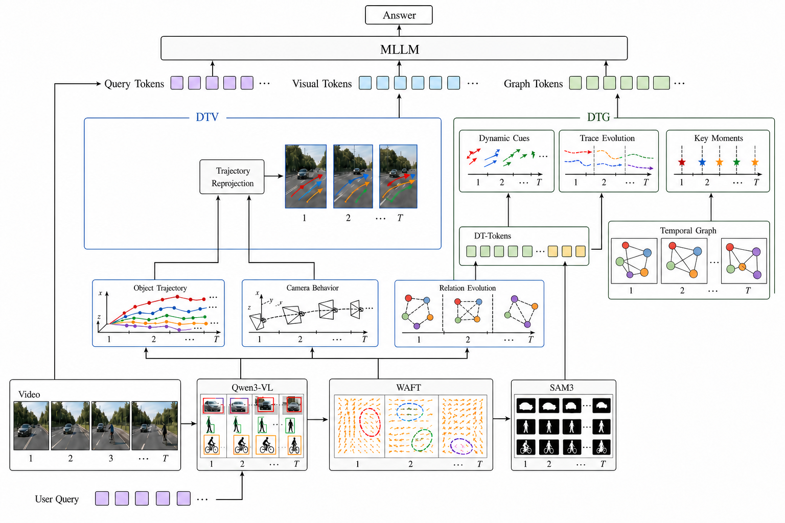
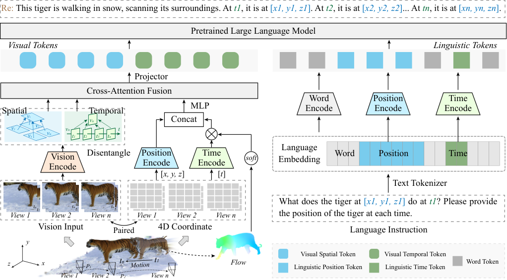
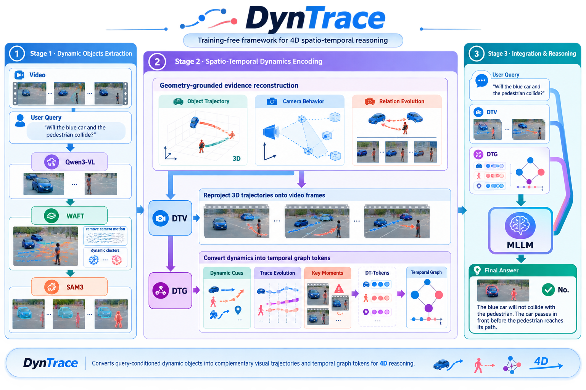
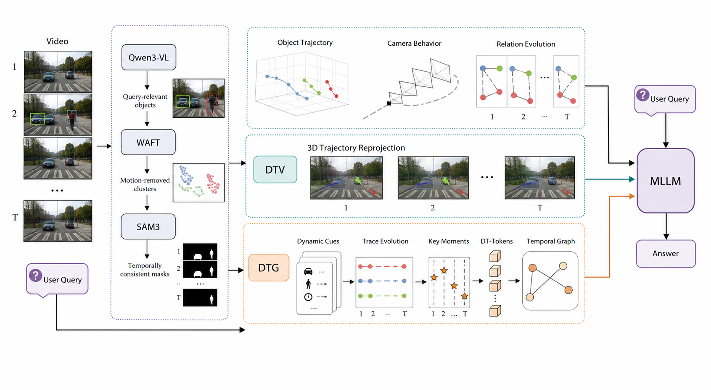
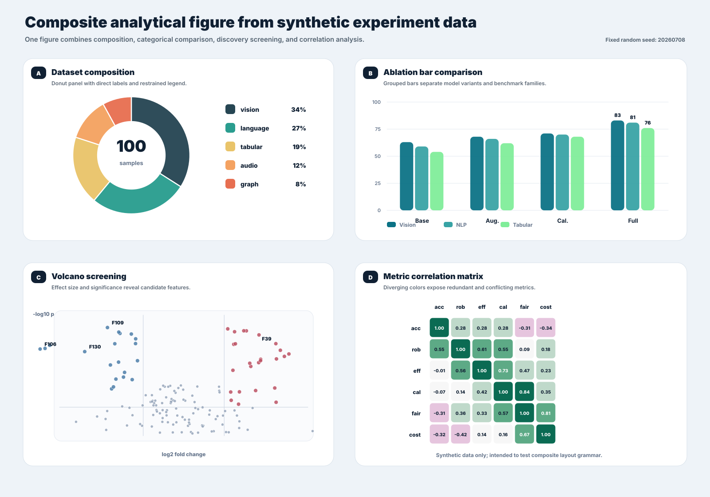
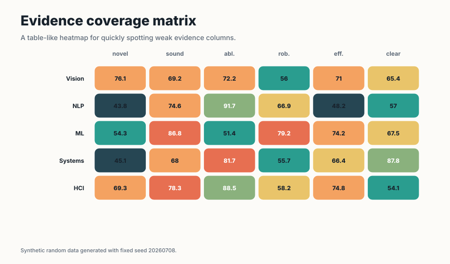
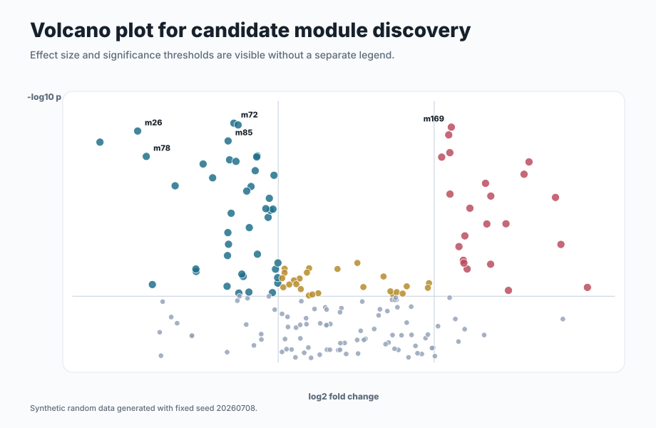
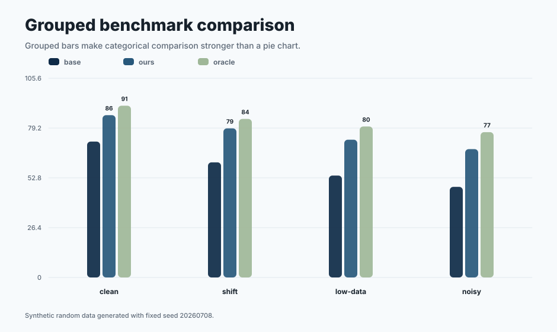
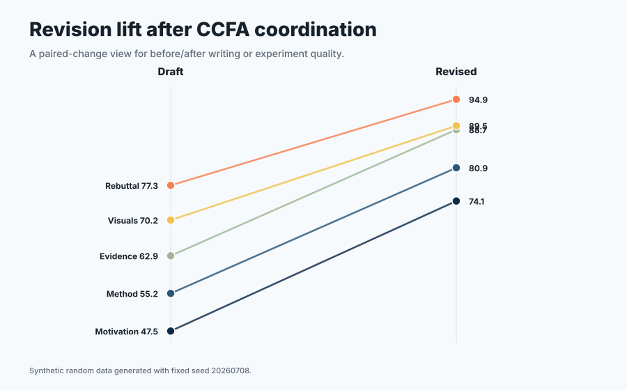
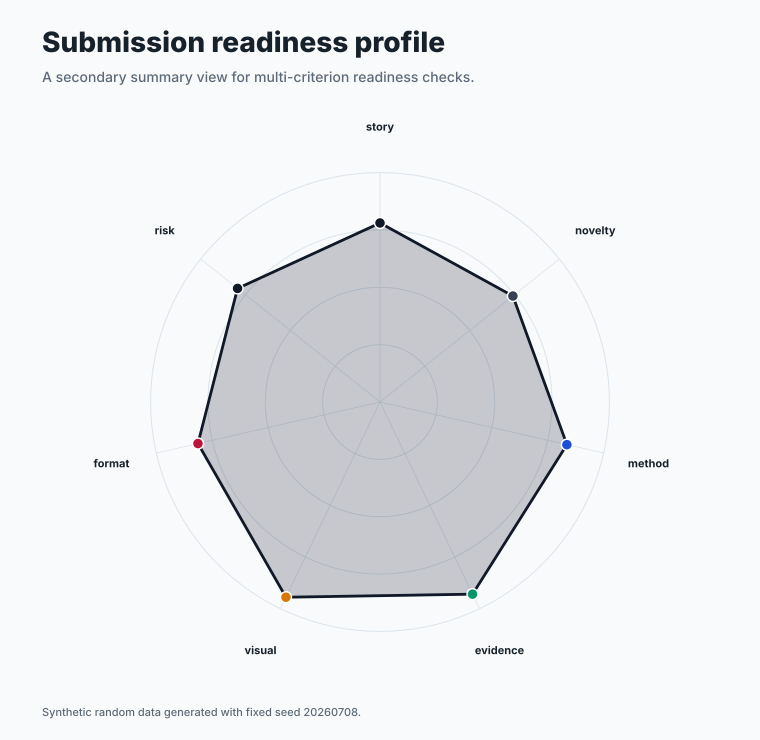

<div align="center">

<h1>CCFA Skills</h1>

**A skill family for shaping the research storyline of CCF-A papers.**

[简体中文](README.md) · [English](README.en.md) · [繁體中文](README.zh-TW.md)


---

*“The structure of the prose becomes the structure of the scientific argument.”*<br>
George D. Gopen and Judith A. Swan, [*The Science of Scientific Writing*](https://www.cs.tufts.edu/comp/150FP/archive/george-gopen/sci.html)

*“The very process of science is centered around communication.”*<br>
Yann LeCun and James M. Manyika, [*Learning Abstractions*](https://www.amacad.org/publication/daedalus/learning-abstractions-conversation-yann-lecun)

</div>

## 目錄

- [快速開始](#快速開始)
- [為什麼需要一個 skill 家族](#為什麼需要一個-skill-家族)
- [家族架構與核心 skills](#家族架構)
- [從 idea 到投稿](#從-idea-到投稿)
- [繪圖示例](#繪圖示例)
- [寫作如何保持自然](#寫作如何保持自然)
- [讓圖既好看，也能繼續修改](#讓圖既好看也能繼續修改)
- [各司其職，彼此接力](#各司其職彼此接力)
- [安裝、維護與驗證](#倉庫結構)
- [Star 旅程](#star-旅程)

凌晨兩點，實驗終於結束，新的結果比預期更好。可是重新打開稿件時，真正棘手的問題才顯現出來：最初那個清晰而有力的研究問題已經埋進冗長的 related work，方法描述與程式中的實際機制出現偏差；新補的實驗回應了上一輪審稿意見，卻讓論證分成幾條彼此疏離的線索。每個局部似乎都更完善了，整篇論文反而更難讀懂。

許多有潛力的研究最終未能充分展現價值，並不是因為 idea 不夠好，而是因為它在漫長的推進中逐漸失去了清晰的輪廓。文獻愈積愈多，實驗表格不斷擴張，作者還要在研究、寫作和審稿視角之間反覆切換。一個無所不包的長 prompt 很難同時做好這些事情，因為檢索需要忠於來源，實驗需要遵循協議，寫作需要圍繞論證展開，審稿則必須保持獨立判斷。

我們因此設計了 CCFA Skills。論文不是等待逐項填充的文件，而是一條需要在反覆修改中保持連貫的研究故事線。17 個分工明確的 skills 從 idea、文獻和實驗出發，幫助論證逐漸成形，並貫穿寫作、繪圖、評審、rebuttal 與投稿。當任務從一個 skill 交給另一個 skill 時，研究問題、證據和結論之間的聯繫仍然會被保留下來。

<p align="center">
  
</p>

## 快速開始

**ICLR 2027 適配更新（2026-09-16）**：依官方指南校準匿名、頁數、年份模板與 AI 使用聲明檢查；評審聚焦影響結論的證據與問題，沿用固定報告結構。[適配細節](ccf-paper-writer/references/venue-guides/iclr.md) · [更新紀錄](CHANGELOG.md)。版本仍為 `0.10.0`。

選擇你正在使用的 Agent：

[Codex 安裝](docs/getting-started/CODEX.md) · [Claude Code 安裝](docs/getting-started/CLAUDE_CODE.md) · [Cursor 安裝](docs/getting-started/CURSOR.md) · [Gemini CLI 安裝](docs/getting-started/GEMINI_CLI.md) · [其他 Agent](docs/getting-started/OTHER_AGENTS.md) · [自動更新](docs/getting-started/AUTO_UPDATE.md)

在 Codex 中一行安裝：

```powershell
npx skills add mikubaka88/CCFA-Skills --global --agent codex --skill '*' --yes --copy
```

安裝後，直接說出你正在面對的研究問題：

```text
嚴格評審這三個選題並排序，指出各自最可能被拒的原因。
檢索近三年與時序視覺推理相關的工作、benchmark 和公開 baseline。
根據這篇論文設計主實驗、消融和穩健性證據，不要虛構結果。
把方法部分改寫為 CVPR 風格，並保留公式、術語和引用。
根據論文繪製方法架構圖，先生成審美稿，再詢問是否重建為 PPTX。
```

## 為什麼需要一個 skill 家族

論文研究中的困難彼此相連，卻不能由同一種思考方式解決。

| 研究者遇到的困境 | CCFA Skills 如何回應 |
|---|---|
| 檢索、實驗、寫作和審稿擠在同一次對話中，彼此干擾 | 由最適合當前任務的 skill 負責，其他能力按需協助 |
| 文獻事實、實驗數字和正文結論逐漸脫節 | 分別核對來源、實驗設計與全文一致性，讓每個 claim 都能找到證據 |
| 論文愈改愈像審稿回覆，充滿防禦、解釋和內部狀態 | 寫作負責形成正文，Humanization 讓語言回到自然、直接的學術表達 |
| 新一輪評審不斷更換關注點，難以判斷修訂是否真正進步 | 同時觀察當前稿件的錄用準備度與相對上一版的實際改進 |
| 架構圖要麼只是方框流程，要麼漂亮卻無法繼續編輯 | 先探索適合內容的視覺語言，再按需要重建為 SVG、PDF 或 PPTX |
| 載入的 skills 愈多，結果反而愈容易受到無關規則干擾 | 只載入與當前問題直接相關的能力，減少無關上下文 |

## 我們珍視什麼

- **讓研究問題先於工具。** 評價一個 idea 與發展一個 idea 是兩種工作；設計實驗與美化圖表也需要不同的判斷。CCFA Skills 讓每一步都回到它真正要回答的問題。
- **讓證據始終有據可查。** 文獻、實驗協議、數值、結論、圖表和引用不會被混成一團。缺失的事實保持缺失，直到它被可靠地找到或驗證。
- **讓論文聽起來像學術，而不是辯護。** Humanization 刪除防禦性鋪墊、機械枚舉、過度破折號和內部工程措辭，同時保留真正影響結論的限制、證據與披露。
- **讓評審保持獨立。** Reviewer 負責判斷，Writer 負責修改。先看問題，再決定如何改，避免一邊審稿一邊替自己解釋。
- **讓科研圖表達清楚，也足夠美觀。** 數值圖保持可重現；方法圖先尋找與內容相稱的構圖，再由使用者決定是否轉成可編輯版本。
- **讓範文成為方向，而不是模板。** 使用者提供目標論文後，系統學習它的敘事節奏、段落職責和證據組織，但不複製原句，也不把一種寫法強加給所有研究。

## 家族架構


所有 CCFA 任務都先啟用 `ccf-humanization`，再啟用 `ccf-common`，然後進入具體技能；檢索、評審、繪圖、實驗與維護也遵循此順序。前者統一自然、直接且保留真實證據的表達，後者落實協作、範圍、證據和檔案規則。同一任務交接時重用已生效規則，只更新變化或遺失的部分；詳細改寫與實驗檢查依實際任務執行，不重複產生前置報告。各技能繼續負責自己的產物並整合必要協作。

### 17 個核心 skills

| 研究階段 | Skill | 它能帶來什麼 |
|---|---|---|
| 家族協調 | `ccf-common` | 理解請求，協調分工，統一證據與隱私規則 |
| 專案推進 | `ccf-pipeline-orchestrator` | 梳理目標、階段、關鍵節點與下一步 |
| 專案起步 | `ccf-project-scaffolder` | 準備論文目錄、模板與研究材料空間 |
| 選題判斷 | `ccf-idea-reviewer` | 判斷思路價值、創新與機制邏輯，預設不審核實驗 |
| 選題發展 | `ccf-idea-optimizer` | 把模糊方向發展成問題、洞察、方法與證據路徑 |
| 文獻檢索 | `ccf-literature-searcher` | 尋找相關工作、資料集、benchmark 與公開 baseline |
| 前沿追蹤 | `ccf-literature-monitor` | 關注新論文、相近工作與研究方向的最新變化 |
| 實驗設計 | `ccf-experiment-designer` | 設計主實驗、消融、穩健性分析與結果表結構 |
| 完整性核驗 | `ccf-integrity-auditor` | 核對 claim、數值、術語、圖表和引用 |
| 論文評審 | `ccf-paper-reviewer` | 給出獨立科學評審、版本比較與錄用準備度判斷 |
| 論文寫作 | `ccf-paper-writer` | 起草、改寫、潤飾與壓縮論文內容 |
| 學術表達 | `ccf-humanization` | 去除防禦性和機械感，保留自然嚴謹的學術表達 |
| 審稿回覆 | `ccf-rebuttal-writer` | 組織 rebuttal、response letter 與修訂記錄 |
| 科研繪圖 | `ccf-visual-composer` | 生成數值圖、視覺表格、方法圖及可編輯版本 |
| 投稿檢查 | `ccf-submission-checker` | 檢查模板、頁數、匿名、PDF 與補充材料 |
| 範文學習 | `ccf-paper-to-exemplar` | 從使用者提供的論文中提煉可重用的寫作方法 |
| 家族維護 | `ccf-skill-forger` | 改進 skills，消除衝突，完成發布前檢查 |

完整職責視圖：


## 從 idea 到投稿


這不是一條必須從頭走到尾的流水線。你可以帶著一個尚未成形的想法而來，也可以只帶來一張難以解釋的結果表、一段總被審稿人誤解的方法，或一份即將提交的 PDF。CCFA Skills 會從你所在的位置開始，只調用真正有幫助的部分。

## 繪圖示例

這裡展示的是實際科研成圖，而不是功能宣傳圖。不同圖面向不同閱讀場景，因此使用不同的構圖語言。

### 論文方法架構圖

下圖從 `output/DynTrace.pdf` 中提取計算關係，以分層版面呈現方法機制與資訊流。輸入與視覺處理位於底部，幾何證據和 DTV/DTG 分支構成中層，token 融合、MLLM 與答案位於頂部。各層按計算依賴連接，便於沿資訊流閱讀完整方法。



**成圖方式：** 先從 DynTrace 論文中提煉機制關係，梳理每種表示及其對應操作，由 GPT Image 2 生成分層架構圖，並核對方法資訊是否完整。目前展示的是 PNG 視覺稿；構圖確認後，可繼續重建為 SVG、向量 PDF 或由原生物件組成的 PPTX。

<details>
<summary>查看參考圖、出處與構圖原則</summary>



參考出處：Hanyu Zhou and Gim Hee Lee, [*LLaVA-4D: Embedding SpatioTemporal Prompt into LMMs for 4D Scene Understanding*](https://arxiv.org/abs/2505.12253), Figure 2；亦見 [OpenReview 頁面](https://openreview.net/forum?id=URpbmVEsqB)。截圖僅用於非商業的學術構圖研究與風格說明，版權歸原作者所有。如涉及侵權，請聯絡專案維護者刪除。

- 論文圖應當讓輸入、表示、操作、分支、融合與輸出一目了然。
- 影片幀、光流、遮罩、3D 軌跡、DT-Tokens 與 temporal graph 都承擔方法含義，而不是裝飾。
- 普通英語使用自然大小寫；Qwen3-VL、WAFT、SAM3、DTV、DTG、MLLM、3D 與 4D 保持規範縮寫。

</details>

### PPT/Poster

下面保留兩張早期視覺探索。它們更適合簡報、專案海報或 README 概覽，因此不作為頂會論文方法圖示例。

#### GPT Image 2 概念稿



**成圖方式：** 從 DynTrace 的三階段方法出發，把影片、軌跡和圖結構轉化為鮮明的視覺敘事，再由 GPT Image 2 完成概念探索。

#### 參考驅動的 PPT/Poster



**成圖方式：** 在三階段內容之上加入參考構圖原則，讓標題、色塊和視覺錨點更適合簡報與海報閱讀。

### 資料分析圖

以下圖形由 `ccf-visual-composer` 的可重現繪圖方案生成。圖中數值僅用於展示圖形語言，不代表論文實驗結論。

| 組合圖 | 熱圖 |
|---|---|
|  |  |
| **火山圖** | **柱狀圖** |
|  |  |
| **坡度圖** | **徑向圖** |
|  |  |

更多示例位於 [`assets/visual-showcase/`](assets/visual-showcase/)。

## 寫作如何保持自然

`ccf-paper-writer` 可以學習使用者指定的範文。它關注優秀論文如何提出問題、展開方法、安排證據和控制節奏，但不會複製原句，也不會把某一篇論文變成所有研究的固定模板。

`ccf-humanization` 逐句判斷表達承載了什麼科學資訊：有事實就直接陳述，有真實不確定性就準確限定，沒有資訊的自辯直接刪除。它清理審稿人預判、貢獻自我降格、重複 caveat、機械結尾和內部版本旁白，不再要求每段補局限性或未來工作。實際失敗、適用條件、重現資訊與必要披露仍保留；僅對證據無法解決的具體科研決策單獨提醒。

思路審核與文章審核依判斷對象區分：「這個方向值得做嗎」由 `ccf-idea-reviewer` 處理，無需指定評分；「稿件結論是否站得住」由 `ccf-paper-reviewer` 處理。即使輸入完整 PDF，只看核心思路的請求也維持概念審核。思路評分聚焦問題、創新、洞察、機制、簡潔性與受眾價值，實驗僅在明確要求時單獨評估。

結構化審核報告預設輸出詳細版，明確要求簡要時使用簡要版。文章審核展開貢獻、優缺點、相關工作、方法與證據、多視角意見、評分及修改優先級；思路審核展開問題價值、創新差異、機制邏輯與發展建議，預設不評實驗。意見綁定具體位置、依據與穩定編號，複審追蹤問題是否解決；不會產生缺乏真實參照集的百分位排名。詳見[文章報告範本](ccf-paper-reviewer/references/fixed-output-format.md)與[思路審核協議](ccf-idea-reviewer/references/strict-idea-review.md)。

完整文章評審固定 14 節，寫作專項固定 9 節，明確要求簡版時使用 5 塊。通用科學評分統一為新穎性、正確性、證據、意義、清晰度、可複核性、倫理與局限七維；證據要求依貢獻類型解釋，置信度與材料覆蓋範圍分開。生成報告可直接檢查 Markdown 的標題順序、評分欄位和問題編號引用；會議或使用者明確指定的格式繼續優先。

文章複審同時回答兩個不同的問題：


- **當前稿件是否足以投稿。** 它衡量論文距離目標 venue 的要求還有多遠。
- **這次修訂是否真正進步。** 它比較新舊版本解決了什麼，又是否引入新的問題。

## 讓圖既好看，也能繼續修改


數值圖優先來自可重現程式和可追溯資料。新的方法圖、系統圖與架構圖通常先由 GPT Image 2 探索與內容相稱的視覺語言，使用者已要求的可編輯 SVG、向量 PDF 或 PPTX 會繼續完成。已有可編輯圖的文字、顏色、間距、數值或匯出修改直接更新來源檔案，並只重新匯出受影響的格式。常見概念使用風格統一的開源圖示，方法特有的科學物件可在初稿中統一繪製，需要重用或編輯時再單獨整理為素材。進入 PPTX 後，文字、框、節點與連接線盡量保留為原生物件，使最終成圖能夠真正修改。

繪圖依內容與論文版面選擇畫布比例，不預設方形。先確定整體分區和重點機制，再安排緊湊的模組、圖示與連線路徑；同類模組跨區域對齊邊緣、文字基線和連接埠，並檢查大塊無效留白。字型依最終論文寬度統一分級，預設 Times New Roman，需要 comic 效果時使用 Comic Sans MS；保留必要科學標註，減少重複解釋和裝飾性數字。

可選預設包括正式機制、柔和機制、視覺證據、幾何流與緊湊漫畫，搭配七套擴充配色。會議情境協助選擇預設，實際模板要求優先；這些是設計建議，不是會議官方風格。預設同時協調字型、線寬、分組和顏色，參考圖各自負責明確的區域或屬性。像素間距是生成目標，精確座標和真實字型在已要求的可編輯版本中校準。局部修改檢查關聯連線和未修改區域，中間檔案仍按圖歸檔並更新目前版本。

如果使用者明確不使用 GPT Image 2，或希望直接從程式生成，`ccf-visual-composer` 會改用純 SVG 路線並清楚標註。

## 各司其職，彼此接力


每個產物有一位負責整合與交付的主責技能，其他技能依前置依賴和品質需要參與。分工不限制必要協作：

| 你的請求 | 負責的 Skill | 明確不負責 |
|---|---|---|
| 思路可靠嗎、值得做嗎、創新夠不夠、評分排序 | `ccf-idea-reviewer` | 預設只審概念，不因缺少實驗扣分 |
| 發展一個模糊 idea | `ccf-idea-optimizer` | 不把排名當成主要目標 |
| 搜 benchmark 與公開結果 | `ccf-literature-searcher` | 不代替實驗結果作出結論 |
| 設計 baseline、指標與消融 | `ccf-experiment-designer` | 不改動或虛構結果 |
| 評審、評分與診斷 | `ccf-paper-reviewer` | 不在評審過程中改寫正文 |
| 改寫、潤飾與壓縮 | `ccf-paper-writer` | 不擅自改變研究問題、方法和結論 |
| 繪製圖表與 PPTX | `ccf-visual-composer` | 不選擇資料集、指標或數字 |

## 倉庫結構

```text
CCFA-Skills/
├── ccf-common/                 # 家族共享規則
├── ccf-*/SKILL.md              # 17 個 skill 入口
├── ccf-*/references/           # 按需閱讀的參考資料
├── ccf-*/scripts/              # 可重現操作
├── assets/                     # README 圖片與繪圖示例
├── evaluation/                 # 回歸與消融結果
├── tools/build_ccfa_diagrams.py
└── 實驗結果.md
```

較長的規則放在 `references/`，可重複執行的操作放在 `scripts/`。迭代過程沿用固定檔名，由新版本覆蓋舊版本，避免堆積難以辨認的過程文件。

協作從最終結果回推前置條件：判斷創新性前核對近鄰工作，實質性寫作前釐清主張、證據和引用，科學繪圖前確認資料含義與方法結構。缺失、衝突或過期的依據交給相應技能補齊；既有且仍適用的證據直接重用。實質性改寫後檢查受影響的論證，解決問題後再交付；思路審核仍不要求實驗完成。內部協作回傳相關發現，正式審稿保留固定模板和必要的全文涵蓋。節省 token 的重點是重複檢索、重複報告、無關參考和重複詢問，不是省略前置工作。詳見[協作路由](ccf-common/references/routing.md)與[交接規則](ccf-common/references/handoff-modes.md)。

檔案約束已前置到全部 17 個 skill 入口。中間檔案優先沿用使用者指定路徑、該產物的 `ccfa.yaml` 對應和既有任務目錄；新任務使用專案根目錄下獨立的 `ccfa-workfiles/<任務用途>/<具體產物>/`，不嵌套在通用 `output/` 中。例如 `figures/method-overview/`、`reviews/paper-short-title/`、`literature/retrieval-memory/` 分別存放方法圖、論文評審和主題檢索的工作檔案。若同名目錄已被其他用途占用，採用穩定的 `ccfa-workfiles-<專案名>/`，不混用或覆蓋。

需要時才建立 `source/`（可重用來源檔案）、`assets/`（參考與圖示）、`cache/`（下載與提取快取）、`build/`（目前預覽與建置日誌）。同一產物跨 skill 共用目錄，普通迭代更新原檔，不使用含義不明的 `temp`、`misc` 或 `final-final`。完成後清理本任務產生且已確認可丟棄的過程檔案，保留原始資料、可編輯來源、最終產物及必要對比證據；失敗生成不覆蓋可用結果。既有目錄不因新命名規則被搬遷，完整規則見[產物合約](ccf-common/references/artifact-contracts.md)。

中文輸出採用明確的 UTF-8 讀寫，相容帶 BOM 的輸入；終端管道、中文檔名和圖形字型分別檢查。家族校驗已加入中文與生僻字回歸，解碼錯誤會明確回報，避免用替換字元掩蓋問題。圖中的中文使用可用的 CJK 後備字型，保留原定的西文字型。

## 維護與驗證

```powershell
python ccf-common\scripts\check_v04.py
python ccf-common\scripts\check_path_privacy.py
python ccf-common\scripts\check_markdown_links.py
python ccf-common\scripts\check_sources.py
```

這些檢查確認 17 個 skills 能被正確識別，彼此職責清楚，文件連結有效，公開檔案不包含本機路徑或私人資訊。實驗與效率結果見 [實驗結果.md](实验结果.md)。

`0.10.0` 完成了規則、結構與腳本驗證；連結中的歷史實驗不代表 GPT-6 實際 token 或品質增益。

## 我們堅持的底線

- 不虛構實驗結果、引用、模組或 venue 規則。
- 私有論文和未公開結果只讀取完成任務所需的內容。
- 外部檢索與圖像生成只在使用者授權後進行，並且只傳遞完成任務所需的資訊。
- 使用者可以停用任意 skill，其他 skills 不會繞過這項選擇。
- 自動評分必須說明量表、比較對象、依據與不確定性。

## 致謝

感謝 [Research-Paper-Writing-Skills](https://github.com/Master-cai/Research-Paper-Writing-Skills) 對學術寫作 skill 開源生態的貢獻。

## Star 旅程

[](https://github.com/mikubaka88/CCFA-Skills/stargazers)

<a href="https://www.star-history.com/?repos=mikubaka88%2FCCFA-Skills&amp;type=date">
  <picture>
    <source media="(prefers-color-scheme: dark)" srcset="https://api.star-history.com/svg?repos=mikubaka88/CCFA-Skills&amp;type=Date&amp;theme=dark" />
    <source media="(prefers-color-scheme: light)" srcset="https://api.star-history.com/svg?repos=mikubaka88/CCFA-Skills&amp;type=Date" />
    
  </picture>
</a>

曲線由 Star History 自動更新，計數徽章由 Shields.io 自動更新。服務與 GitHub 圖片快取可能延遲顯示，曲線通常快取約 24 小時，因此不是秒級即時；點擊圖表可開啟互動頁面。

[查看 2026-08-13 歷史快照（離線可用）](assets/ccfa-skills-star-history.zh-TW.svg)
