<h1 align="center">CCFA Skills</h1>

<p align="center"><strong>A skill family for shaping the research storyline of CCF-A papers.</strong></p>

<p align="center">
  <a href="README.md">简体中文</a> ·
  <a href="README.en.md">English</a> ·
  <strong>繁體中文</strong>
</p>

<p align="center">
  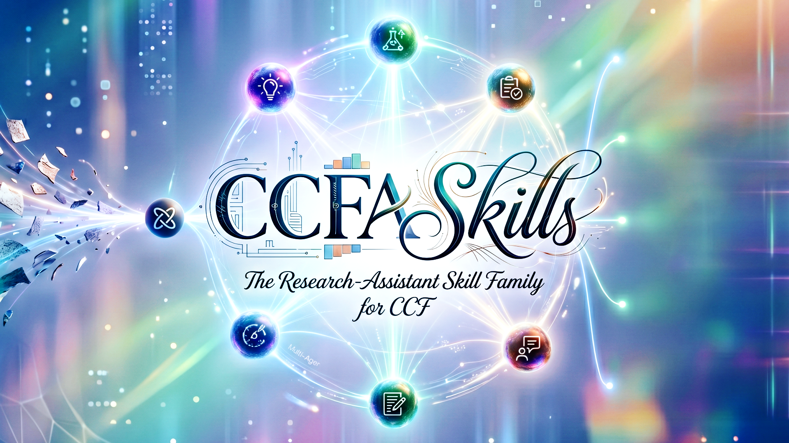
</p>

---

<div align="center">
  <p>
    <span style="color:#334155"><em>"The structure of the prose becomes the structure of the scientific argument."</em></span><br>
    <sub>George D. Gopen and Judith A. Swan, <a href="https://www.cs.tufts.edu/comp/150FP/archive/george-gopen/sci.html"><em>The Science of Scientific Writing</em></a></sub>
  </p>
  <p>
    <span style="color:#2563eb"><em>"The very process of science is centered around communication."</em></span><br>
    <sub>Yann LeCun and James M. Manyika, <a href="https://www.amacad.org/publication/daedalus/learning-abstractions-conversation-yann-lecun"><em>Learning Abstractions</em></a></sub>
  </p>
</div>

一篇高水準論文真正重要的，往往不是最後那份 PDF，而是貫穿其後的研究故事線。它從一個尚不穩定的 idea 開始，在文獻中尋找位置，在實驗中接受檢驗，在寫作中被組織成可被審稿人理解的論證，又在審稿和 rebuttal 中繼續被修正。真正困難的地方，不只是寫出某一段 introduction，而是讓 idea、證據、實驗、表達和回應始終指向同一個研究問題。

CCFA Skills 正是從這個觀察出發。它把 CCF-A 論文專案看作一條可以被維護、稽核和反覆推進的研究故事線，而不是一次性的文本生成任務。一個 idea 需要先被塑形，在真正需要取捨時再接受嚴格審稿；一組實驗需要服務於明確 claim，而不是孤立地填滿表格；一篇論文的寫作需要保留證據邊界；一次 rebuttal 也不應只是臨時答辯，而應成為下一輪修改和重投的可追蹤記錄。

這個專案的核心 insight 是：論文品質來自連續決策的品質。當前家族包含 17 個 runtime roles，並把 `ccf-humanization` 放在論文和投稿實驗產物的最前面：正文保持流暢、自然、嚴謹的學術表達，warning 獨立交給使用者審核，smoke 只保留有效且不重複的關鍵路徑，禁用通用 SHA-256 provenance 儀式。方法完整性由內部流程校驗，論文則直接、自然地描述實際採用的方法，不寫入「已確認」「已批准」等工程狀態。

## v0.8 核心升級圖示

v0.8 保持原有 17-skill 家族架構和論文專案閉環不變，集中增強兩個橫向能力：`ccf-humanization` 作為最高優先級預檢，`ccf-visual-composer` 負責內容驅動的科研架構圖、生成確認、結構 QA 與可編輯 SVG/PDF 重建。三張 demo 僅標題使用簡體中文，圖內模組、標籤和句子保持英文；普通英文採用自然的標題式或句式大小寫，CCF、GPT、QA、SVG、PDF、AI、PNG、SHA-256 等縮寫保持標準全大寫。

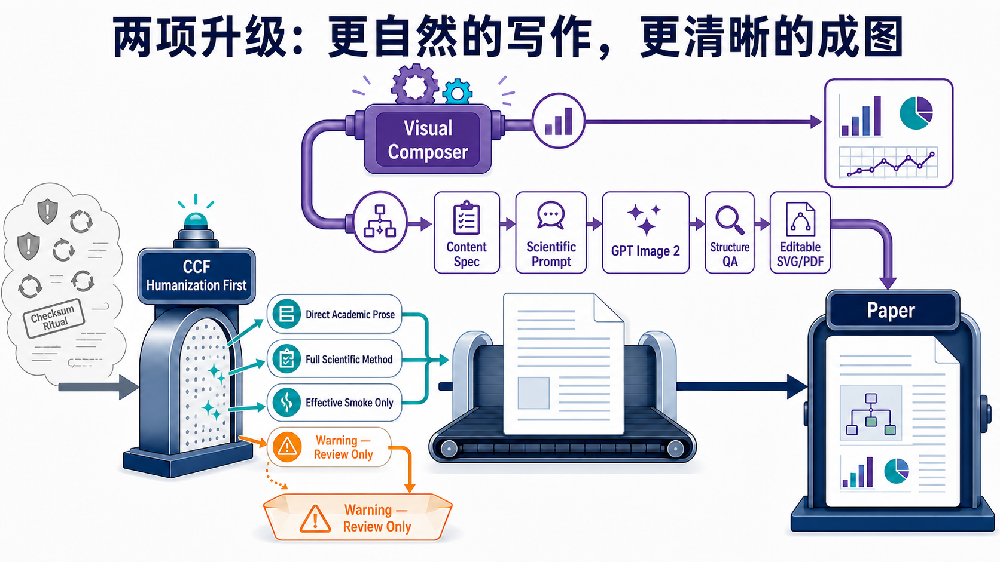

具體的 Transformer demo 展示 `Visual Composer` 如何從通用黑盒圖轉為可核對的編碼器—解碼器拓撲，並保留 `GPT Image 2 → Structure QA → Editable SVG/PDF` 交付鏈；`CCF Humanization` demo 則展示如何保留流暢自然且嚴謹的學術表達、精簡 smoke 測試，並把方法版本校驗留在內部流程、把需要判斷的問題留在獨立審核警告中。

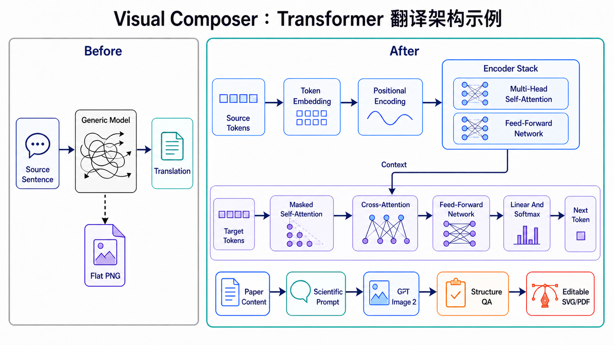

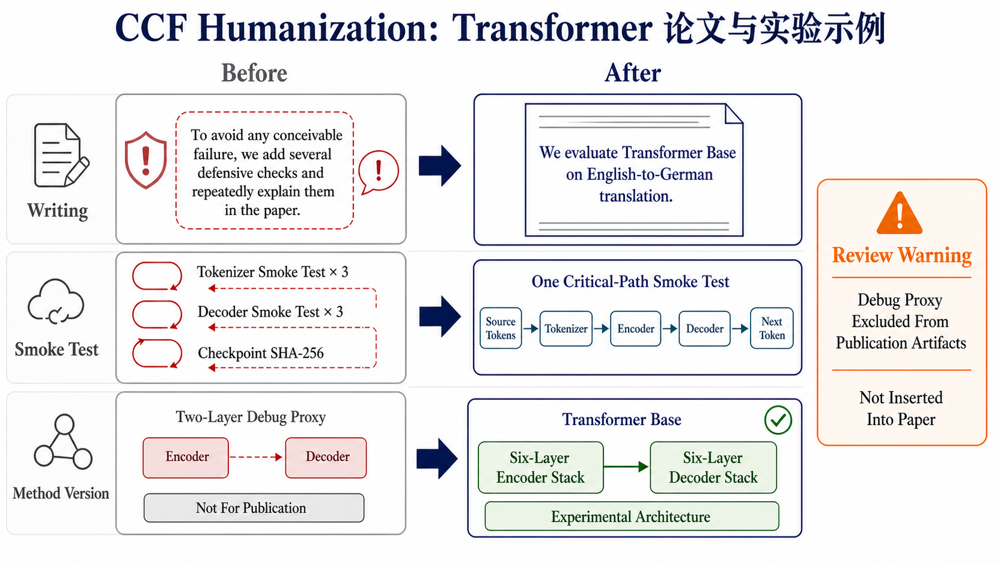

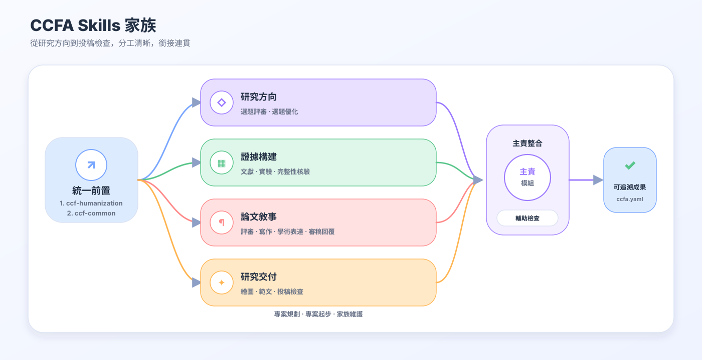

## 整體鏈路

預設論文專案閉環如下：

```text
人類化優先預檢
  -> 專案搭建
  -> 流程編排
  -> idea 優化
  -> idea 審稿
  -> 文獻監控 / 競品追蹤
  -> 文獻檢索
  -> 實驗設計
  -> 圖表視覺整合
  -> 寫作範例抽取（可選）
  -> 會議感知寫作
  -> 科學/寫作審稿
  -> 完整性稽核
  -> 投稿包檢查
  -> rebuttal / revision ledger / resubmission
```

每個階段只交給一個 owner skill。這樣做的目的不是減少功能，而是讓觸發條件、輸出格式和 artifact 歸屬更穩定：寫作由 writer 負責，判斷由 reviewer 負責，事實核驗由 auditor 負責，投稿包由 submission checker 負責，回應審稿人由 rebuttal writer 負責。

`ccfa.yaml` 是共享專案狀態檔。它記錄 `target_venue`、`stage`、`artifacts`、`claims`、`experiments`、`reviews`、`revision_ledger` 和 `submission_checks`，讓各個 skill 可以聯動，但不會互相覆蓋正文、實驗表、審稿報告或 rebuttal。

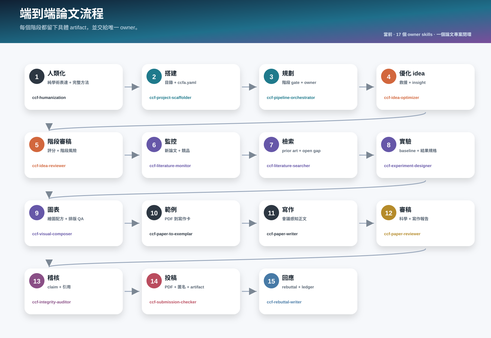

## 17 個 Runtime Skills

| 階段 | Skill | 啟動條件 | 主要產物 | 不應該用於 |
| --- | --- | --- | --- | --- |
| 最高優先級預檢 | `ccf-humanization` | 去除防禦性寫作、隔離 warning、精簡重複 smoke、禁用通用 SHA-256 要求，或阻止簡化方法進入論文。 | 人類化產物、內部方法版本校驗、獨立 warning ledger。 | 隱藏實質證據、代替論文寫作/實驗設計或覆蓋強制披露。 |
| 專案搭建 | `ccf-project-scaffolder` | 使用者要建立論文專案目錄、複製模板、初始化 `ccfa.yaml`。 | 專案目錄、模板檔、初始狀態檔。 | 生成研究內容或替使用者寫 idea。 |
| 流程編排 | `ccf-pipeline-orchestrator` | 使用者要拆任務、排階段、設 gate、決定下一步 owner。 | 階段計畫、gate、handoff、狀態更新建議。 | 直接寫作、審稿、檢索、設計實驗或 rebuttal。 |
| Idea 優化 | `ccf-idea-optimizer` | 使用者有粗 idea、模糊方向、想找方向或救方向。 | problem-gap-insight-method-evidence 文件、救援路線、最小可驗證問題。 | 對多個 idea 排名打分。 |
| Idea 審稿 | `ccf-idea-reviewer` | 使用者明確要求評分、排名、嚴格審稿、判斷創新性或取捨。 | 分數、風險、stage-aware 發展潛力、修改建議。 | 繼續發散優化單個 idea。 |
| 文獻監控 | `ccf-literature-monitor` | 使用者要追蹤新論文、競品、arXiv/OpenReview/會議動態，或問最近有沒有類似 idea。 | 監控報告、overlap level、RELAX/RESEARCH/FOLLOW-UP 標記、跨 skill handoff。 | 系統性 related work 檢索、引用稽核或最終 idea 打分。 |
| 文獻證據 | `ccf-literature-searcher` | 使用者要查 related work、prior art、資料集、benchmark、open gap 或引用證據。 | 文獻列表、篩選理由、相關工作結構、機會圖、證據缺口。 | 只核驗已經寫進論文的引用，或把 related work 當成最終否決。 |
| 實驗設計 | `ccf-experiment-designer` | 使用者要設計 baseline、metric、消融、魯棒性實驗或結果表。 | 實驗協議、baseline 矩陣、結果表模板、evidence-bound 圖表規格。 | 編造結果或繪製文件架構圖。 |
| 科研成圖 | `ccf-visual-composer` | 使用者要製作資料分析圖、論文方法/模型/系統架構圖、科研繪圖 prompt、GPT Image 2 草稿、可編輯 SVG/PDF、caption 或正文嵌入。 | visual contract、可重現 plot code、內容驅動的架構圖 prompt、經確認的生成稿、語義化 SVG/向量 PDF、caption、render QA ledger。 | 設計實驗、編造結果/模組、主寫正文或最終投稿合規。 |
| 寫作範例 | `ccf-paper-to-exemplar` | 使用者提供論文 PDF，希望抽取成可複用寫作範例或個人 exemplar 庫。 | exemplar card、寫作 pattern、venue 標籤、writer 可用索引。 | 直接寫論文或進行審稿。 |
| 論文寫作 | `ccf-paper-writer` | 使用者要寫、潤飾、壓縮、改寫、從 idea 起草 LaTeX、按目標會議篇幅成稿、做 slides/poster/talk。 | 論文正文、保留格式的修改稿、壓縮稿、篇幅預算、展示材料。 | 完整審稿、事實稽核、投稿包檢查或 rebuttal。 |
| 論文審稿 | `ccf-paper-reviewer` | 使用者要科學審稿、寫作審稿、評分、AC/meta-review 或投稿風險診斷。 | 科學審稿、寫作審稿、風險表、評分和修改優先級。 | 直接替換正文或寫 rebuttal。 |
| 完整性稽核 | `ccf-integrity-auditor` | 使用者要核驗 claim、數字、圖表、引用、BibTeX 和上下文支撐。 | claim-support 表、數字一致性報告、引用稽核。 | broad literature search 或完整科學審稿。 |
| 投稿檢查 | `ccf-submission-checker` | 使用者要查會議規則、頁數、匿名、PDF metadata、artifact、camera-ready。 | 投稿包檢查、LaTeX/PDF 構建結果、匿名和 artifact checklist。 | 潤飾正文內容。 |
| 審稿回覆 | `ccf-rebuttal-writer` | 使用者要寫 rebuttal、response letter、revision ledger 或重投計畫。 | rebuttal 文案、逐條回應、revision ledger、resubmission plan。 | 普通論文寫作。 |
| 共享治理 | `ccf-common` | 維護路由、隱私/證據策略、source registry、artifact contract。 | 公共規則、路由表、source registry、校驗策略。 | 普通研究任務。 |
| 家族維護 | `ccf-skill-forger` | 維護 skill、命名、docs、SVG、校驗、release。 | 更新後的技能文件、文件、圖、驗證結果和發布提交。 | 研究寫作、審稿或實驗設計。 |

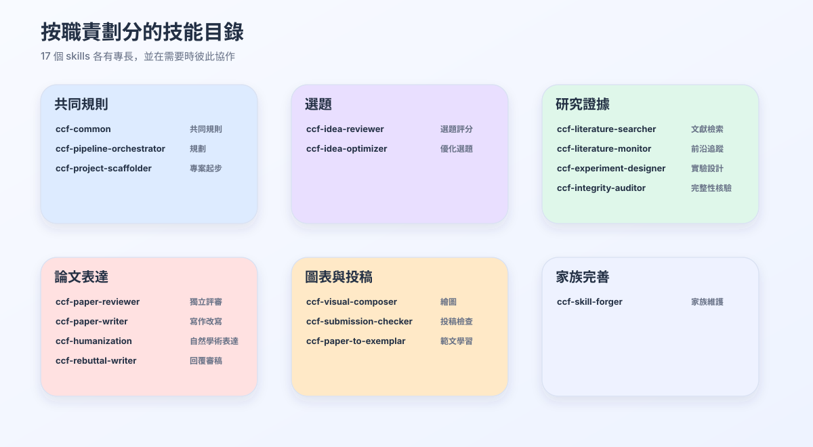

## 觸發邊界

| 使用者真正要做的事 | 使用 | 不使用 |
| --- | --- | --- |
| 去掉防禦性寫作、warning 不注入文件、精簡重複 smoke、阻止簡化方法進入論文 | `ccf-humanization` | `ccf-paper-reviewer` |
| 把模糊 idea 變成可做的研究方案，或找救援路線 | `ccf-idea-optimizer` | `ccf-idea-reviewer` |
| 明確要對多個 idea 打分、排序、取捨 | `ccf-idea-reviewer` | `ccf-idea-optimizer` |
| 監控新論文、競品、最近是否有類似 idea | `ccf-literature-monitor` | `ccf-literature-searcher` |
| 找新文獻、找 benchmark、找資料集、找 open gap | `ccf-literature-searcher` | `ccf-integrity-auditor` |
| 核驗論文裡已引用文獻是否支撐 claim | `ccf-integrity-auditor` | `ccf-literature-searcher` |
| 設計實驗、指標、baseline 和結果證據結構 | `ccf-experiment-designer` | `ccf-paper-writer` |
| 優化資料圖表，或根據論文內容生成方法/架構圖並轉成可編輯 SVG/PDF | `ccf-visual-composer` | `ccf-experiment-designer` |
| 把 PDF 論文轉成寫作範例 | `ccf-paper-to-exemplar` | `ccf-paper-writer` |
| 寫正文、潤飾、壓縮、保持原格式改寫 | `ccf-paper-writer` | `ccf-paper-reviewer` |
| 判斷論文能否被接收、哪裡會被拒 | `ccf-paper-reviewer` | `ccf-paper-writer` |
| 檢查頁數、匿名、PDF、metadata、artifact | `ccf-submission-checker` | `ccf-paper-writer` |
| 回覆審稿人和維護 revision ledger | `ccf-rebuttal-writer` | `ccf-paper-reviewer` |
| 改文件圖、維護 skill、發 release | `ccf-skill-forger` | `ccf-experiment-designer` |

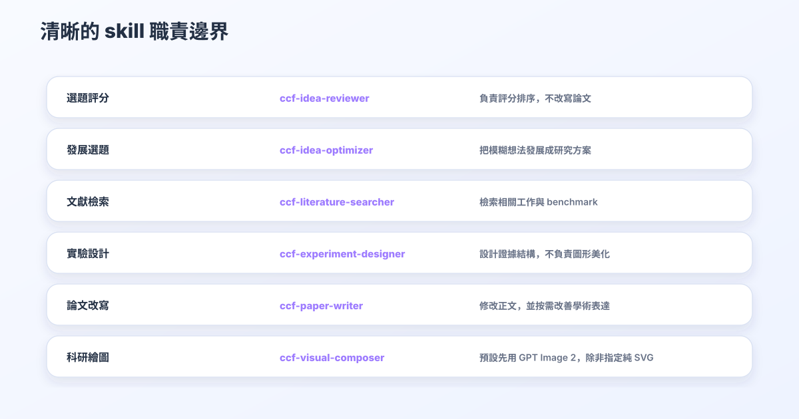

## 已合併的 Helper 能力

這些舊名稱不要再作為獨立 runtime skills 安裝：

```text
ccf-workflow-planner
ccf-paper-compressor
ccf-writing-reviewer
ccf-citation-auditor
ccf-figure-table-builder
ccf-artifact-packager
ccf-venue-format-guide
ccf-resubmission-adapter
ccf-paper-presenter
ccf-doc-diagram-designer
```

| 已合併能力 | 目前 owner | 原因 |
| --- | --- | --- |
| workflow planning | `ccf-pipeline-orchestrator` | 規劃和編排必須共享同一個階段狀態。 |
| compression、slides、poster、talk、Q&A | `ccf-paper-writer` | 都屬於論文文本或論文派生文本。 |
| writing review | `ccf-paper-reviewer` | 它是審稿模式，不是寫作模式。 |
| citation audit | `ccf-integrity-auditor` | 核驗引用屬於事實完整性。 |
| figure/table builder | `ccf-experiment-designer` + `ccf-visual-composer` | 前者綁定真實實驗結果和證據結構，後者負責發表級視覺表達、Python 繪圖程式碼、配色、caption 和渲染 QA。 |
| artifact packager、venue format guide | `ccf-submission-checker` | 都屬於投稿包 readiness。 |
| resubmission adapter | `ccf-rebuttal-writer` | 重投需要基於 reviewer response 和 revision ledger。 |
| docs SVG designer | `ccf-skill-forger` | 文件圖是家族維護，不是論文實驗圖。 |

## Artifact 合約

CCFA 的 artifact 設計是為了避免 skill 互相覆蓋。

| Artifact | 主要 owner | 其他 skill 如何使用 |
| --- | --- | --- |
| `ccfa.yaml` | `ccf-project-scaffolder`, `ccf-pipeline-orchestrator` | 讀取階段、目標會議、產物狀態和 gate。 |
| idea brief | `ccf-idea-optimizer` | reviewer 評分，writer 用於正文 story。 |
| idea review | `ccf-idea-reviewer` | optimizer 和 experiment designer 用於修正方向。 |
| literature notes | `ccf-literature-searcher` | writer 寫 related work，auditor 檢查引用支撐。 |
| experiment plan/results | `ccf-experiment-designer` | writer 寫實驗，auditor 查數字一致性。 |
| visual contracts/figures/tables/plot scripts | `ccf-visual-composer` | writer 連接正文敘事，auditor 查數字一致性，submission checker 查最終格式。 |
| manuscript | `ccf-paper-writer` | reviewer/auditor/submission checker 只診斷或檢查。 |
| review report | `ccf-paper-reviewer` | writer 修稿，rebuttal writer 提取回應點。 |
| integrity report | `ccf-integrity-auditor` | writer 修 claim，literature searcher 補證據。 |
| submission check | `ccf-submission-checker` | writer 修格式，rebuttal writer 準備後續版本。 |
| revision ledger | `ccf-rebuttal-writer` | orchestrator 追蹤 reviewer comment 到 action 的閉環。 |

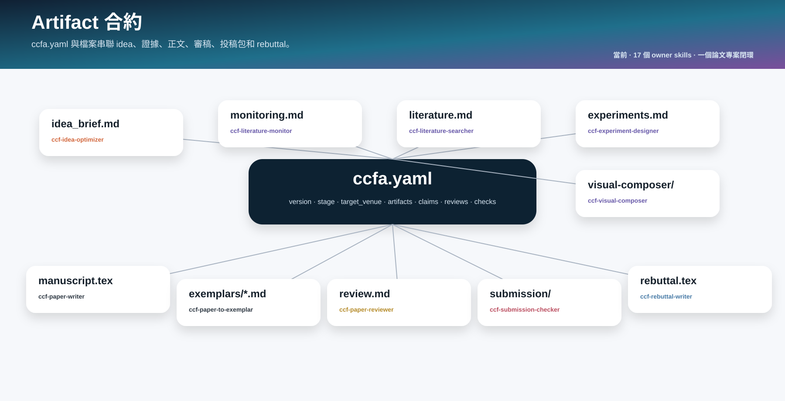

## 寫作與審稿輸出原則

- 寫作、潤飾、壓縮、presentation 任務應服從使用者要求的輸出格式。
- 使用者給 LaTeX 就保持 LaTeX，給 Markdown 就保持 Markdown。
- 使用者只有 idea 且要求從 0 寫文章時，`ccf-paper-writer` 先讀取目標會議 venue guide 和篇幅預算；如果沒有目標會議或找不到 guide，回退 NeurIPS 模板。
- 投稿式完整稿件不能只求可編譯：應接近目標會議主文篇幅，短太多要擴寫，超出篇幅再由 writer 的 compression 模式壓縮，最後交給 `ccf-submission-checker` 檢查頁數。
- 非 review 類 skill 應該靈活、資訊密度高，產出具體 artifact，而不是空泛流程說明。
- review、audit、submission gate 可以保持嚴格結構，因為它們的價值是可追蹤的判斷、風險和 pass/fail 檢查。
- 所有 skill 都不能編造實驗結果、引用、官方規則或 reviewer 結論。

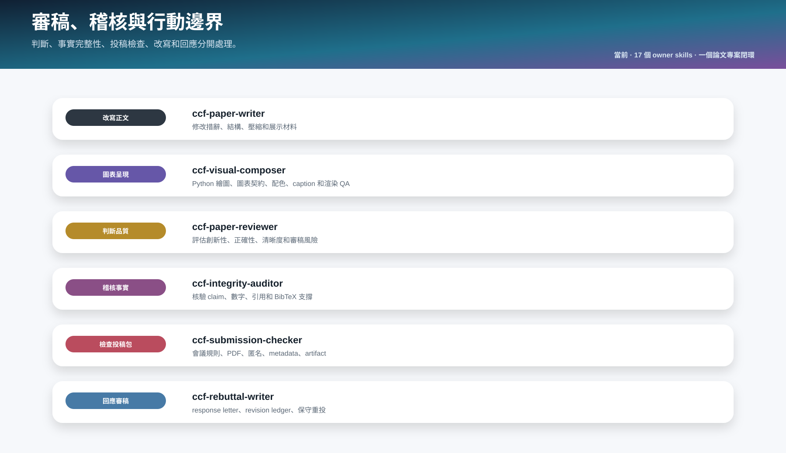

## Venue Guides

會議 LaTeX/template 資訊是 reference，不是 runtime skill：

```text
ccf-paper-writer/references/venue-guides/index.md
ccf-paper-writer/references/venue-guides/<venue>.md
```

| 場景 | 使用 |
| --- | --- |
| 按 ICLR/NeurIPS/CVPR 等目標會議寫正文 | `ccf-paper-writer` 先讀 venue guide，再寫正文。 |
| 檢查頁數、匿名、PDF metadata、camera-ready、artifact | `ccf-submission-checker`。 |
| 只問某會議 LaTeX/template/page limit | `ccf-submission-checker`，必要時讀取 venue guide。 |
| 找不到目標會議 guide | `ccf-paper-writer` 預設回退 NeurIPS 模板，並提示最終投稿前需重新核驗。 |

## 安裝

完整安裝：

```bash
git clone https://github.com/mikubaka88/CCFA-Skills.git
mkdir -p "$CODEX_HOME/skills"
cp -R CCFA-Skills/ccf-* "$CODEX_HOME/skills/"
```

部分安裝必須包含 `ccf-common`：

```bash
skills=(ccf-common ccf-humanization ccf-paper-writer ccf-visual-composer ccf-paper-reviewer ccf-submission-checker)
mkdir -p "$CODEX_HOME/skills"
for s in "${skills[@]}"; do cp -R "$s" "$CODEX_HOME/skills/"; done
```

PowerShell：

```powershell
$skills = @("ccf-common", "ccf-humanization", "ccf-paper-writer", "ccf-visual-composer", "ccf-paper-reviewer", "ccf-submission-checker")
New-Item -ItemType Directory -Force "$env:CODEX_HOME\skills" | Out-Null
foreach ($s in $skills) { Copy-Item -Recurse -Force $s "$env:CODEX_HOME\skills\" }
```

| 組合 | 包含 | 適合 |
| --- | --- | --- |
| 全流程 | 17 個 runtime skills | 從 idea 到 rebuttal 的完整論文專案。 |
| 寫作子集 | `ccf-common`, `ccf-humanization`, `ccf-paper-writer`, `ccf-visual-composer`, `ccf-paper-reviewer`, `ccf-submission-checker` | 人類化預檢、起草、潤飾、圖表視覺整合、寫作審稿、格式檢查。 |
| 監控子集 | `ccf-common`, `ccf-literature-monitor`, `ccf-literature-searcher`, `ccf-idea-reviewer`, `ccf-idea-optimizer` | 追蹤新論文、競品和 novelty 風險。 |
| 早期研究子集 | `ccf-common`, `ccf-humanization`, `ccf-idea-optimizer`, `ccf-idea-reviewer`, `ccf-literature-monitor`, `ccf-literature-searcher`, `ccf-experiment-designer` | 寫正文前的 idea、文獻監控、文獻檢索和確認版本實驗設計。 |
| 圖表/正文呈現子集 | `ccf-common`, `ccf-humanization`, `ccf-experiment-designer`, `ccf-visual-composer`, `ccf-paper-writer`, `ccf-integrity-auditor`, `ccf-submission-checker` | 基於真實結果製作論文圖表、配色、caption、正文嵌入和一致性檢查。 |
| 投稿子集 | `ccf-common`, `ccf-humanization`, `ccf-paper-writer`, `ccf-visual-composer`, `ccf-integrity-auditor`, `ccf-submission-checker` | 已有稿件的人類化、完整性、圖表展示和投稿包檢查。 |
| 維護子集 | `ccf-common`, `ccf-skill-forger` | 維護技能、文件、SVG 和 release。 |

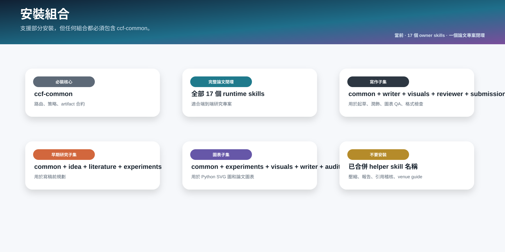

## 進一步閱讀

如果你想理解這個家族為什麼這樣設計，建議按下面順序閱讀：

| 文件 | 適合什麼時候看 |
| --- | --- |
| [docs/ARCHITECTURE.md](docs/ARCHITECTURE.md) | 想理解主鏈路、治理層、artifact 狀態和 revision loop。 |
| [docs/SKILLS_CATALOG.md](docs/SKILLS_CATALOG.md) | 想查每個 skill 的啟動條件、邊界和容易誤觸發的場景。 |
| [docs/INSTALLATION_MATRIX.zh-TW.md](docs/INSTALLATION_MATRIX.zh-TW.md) | 想只安裝部分 skills，判斷哪些必須裝、哪些不能單獨裝。 |
| [docs/NAMING_AND_MERGE_AUDIT.md](docs/NAMING_AND_MERGE_AUDIT.md) | 想理解為什麼合併 helper skills，以及命名如何減少衝突。 |
| [AGENT_GUIDE.md](AGENT_GUIDE.md) | 給 agent 使用的操作指南，說明如何選擇 owner、交接 artifact、避免覆蓋。 |
| [demo/attention-is-all-you-need/](demo/attention-is-all-you-need/) | 想看一個完整 ICLR 風格閉環示例。 |

## Demo

`demo/attention-is-all-you-need/` 是一個 ICLR 風格閉環 demo，用原始 Transformer 論文展示 CCFA 家族如何從原文思路提煉、idea 審稿、LaTeX 寫作、visual-composer SVG 繪圖示例、寫作/科學審稿、完整性稽核、投稿檢查走到 rebuttal。demo 是示例，不是必須閱讀的入口。

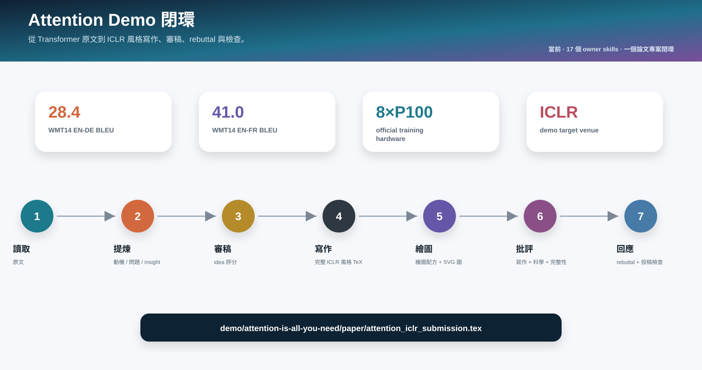

## 維護與驗證

```bash
python ccf-common/scripts/check_v04.py
python ccf-common/scripts/check_markdown_links.py
python ccf-common/scripts/check_sources.py
python ccf-common/scripts/check_path_privacy.py .
python tools/build_ccfa_diagrams.py
```
