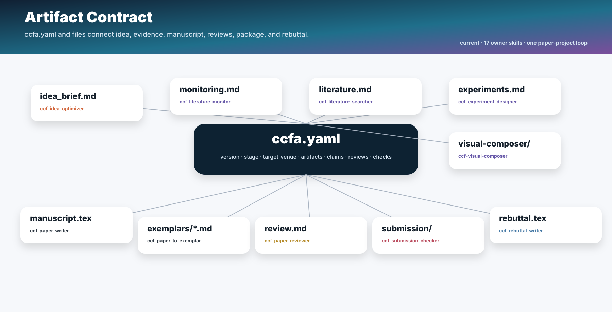
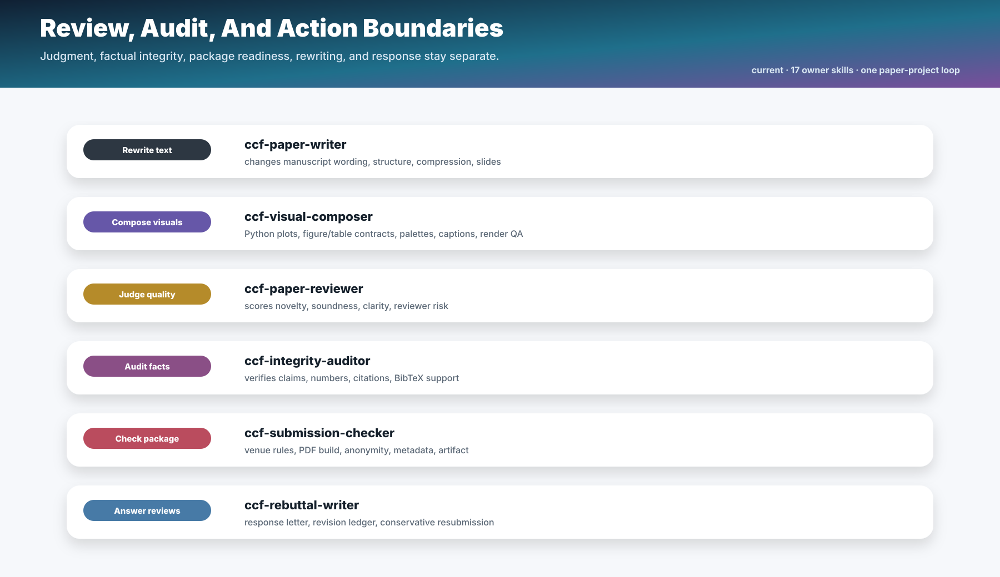

# CCFA Architecture

CCFA is a paper-project workflow family, not a loose collection of unrelated writing prompts. The current 17-skill architecture has one owner per responsibility area, a first-priority humanization overlay, and `ccfa.yaml` plus explicit artifact contracts to keep stages connected.


## Core Model

The family has three layers:

| Layer | Purpose | Skills |
| --- | --- | --- |
| Priority humanization overlay | Keep manuscript and experiment outputs direct, non-defensive, version-confirmed, and free of repeated ineffective smoke tests before content owners act. | `ccf-humanization` |
| Research production chain | Move a paper project from project setup to rebuttal. | `ccf-project-scaffolder`, `ccf-pipeline-orchestrator`, `ccf-idea-optimizer`, `ccf-idea-reviewer`, `ccf-literature-monitor`, `ccf-literature-searcher`, `ccf-experiment-designer`, `ccf-visual-composer`, `ccf-paper-to-exemplar`, `ccf-paper-writer`, `ccf-paper-reviewer`, `ccf-integrity-auditor`, `ccf-submission-checker`, `ccf-rebuttal-writer` |
| Shared state and policy | Keep routing, evidence, privacy, source registry, and artifact ownership consistent. | `ccf-common` |
| Family maintenance | Maintain skills, docs, generated SVGs, validation, and releases. | `ccf-skill-forger` |

The main chain is:

```text
priority preflight: humanize artifact and isolate warnings

scaffold -> orchestrate -> optimize idea -> review idea
         -> monitor recent literature -> search literature
         -> design experiments -> compose visuals -> optional exemplar extraction
         -> write manuscript -> review manuscript -> audit integrity
         -> check submission -> rebuttal / ledger / resubmission
```

The rebuttal stage can loop back to writing, experiments, integrity audit, or submission checks. This is why rebuttal is not a dead-end output skill; it owns response structure and ledger discipline, while actual manuscript edits go back to `ccf-paper-writer`.

## Artifact State

`ccfa.yaml` records the project state:

- `version`
- `project`
- `target_venue`
- `stage`
- `artifacts`
- `claims`
- `experiments`
- `reviews`
- `revision_ledger`
- `submission_checks`

The file is not meant to contain the whole paper. It is a routing and status spine. Concrete outputs still live in manuscript, review, evidence, experiment, submission, artifact, and rebuttal files.



## Owner Boundaries

The family intentionally merged helper skills into owner modes. `ccf-visual-composer` carries a small self-contained Python SVG plotting recipe library for reproducible data figures and a gated architecture-diagram workflow: content-derived prompt, explicit GPT Image 2 confirmation, generated-draft inspection, then an opt-in semantic SVG/vector-PDF reconstruction.

| Capability | Owner | Boundary |
| --- | --- | --- |
| Humanization and publication-faithfulness | `ccf-humanization` | Runs before writing/experiment publication output; removes defensive prose, isolates warnings, deduplicates smoke tests, and blocks simplified publication methods without hiding material evidence. |
| Workflow planning | `ccf-pipeline-orchestrator` | Coordinates stages; does not write, search, review, or rebut. |
| Literature monitoring | `ccf-literature-monitor` | Tracks recent papers, venue feeds, labs, and competitors; deep retrieval stays with literature search. |
| Compression and presentations | `ccf-paper-writer` | Changes manuscript-derived text; does not judge acceptance risk. |
| Exemplar extraction | `ccf-paper-to-exemplar` | Converts PDFs into writing pattern cards; does not draft or review manuscripts. |
| Writing review | `ccf-paper-reviewer` | Diagnoses writing and format-facing risk; does not rewrite unless handed back to writer. |
| Citation audit | `ccf-integrity-auditor` | Checks existing citations; broad discovery stays with literature search. |
| Result evidence and specs | `ccf-experiment-designer` | Uses real results; never invents numbers. |
| Publication visuals | `ccf-visual-composer` | Owns reproducible data plots plus research method/architecture diagrams, content-derived GPT Image 2 prompts and generation gates, semantic editable SVG/PDF reconstruction, palettes, captions, manuscript integration, and render QA. |
| Venue format and artifacts | `ccf-submission-checker` | Checks package readiness; content polishing stays with writer. |
| Resubmission adaptation | `ccf-rebuttal-writer` | Maintains response/ledger logic; manuscript edits route back to writer. |
| Docs SVGs | `ccf-skill-forger` | Repository maintenance only; research figures/tables stay with experiment designer and visual composer. |



## Venue Branch

Venue-specific LaTeX and policy notes are reference material:

```text
ccf-paper-writer/references/venue-guides/index.md
ccf-paper-writer/references/venue-guides/<venue>.md
```

Use `ccf-paper-writer` for venue-aware manuscript text and page-budget-aware drafting. Use `ccf-submission-checker` for final page limits, anonymity, PDF metadata, camera-ready checks, and package readiness. If a from-scratch writing request names a venue, writer reads the venue guide and length budget first; if no venue is named or the guide is missing, writer falls back to the NeurIPS template. Underfilled full drafts stay with writer for expansion; overfilled drafts stay with writer for compression before final submission checks.

## Source Of Truth

`SKILL.md` is authoritative for runtime behavior. These files are public indexes and audit aids:

- [SKILLS_CATALOG.md](SKILLS_CATALOG.md)
- [NAMING_AND_MERGE_AUDIT.md](NAMING_AND_MERGE_AUDIT.md)
- `ccf-common/references/routing.md`
- `ccf-common/references/skill-trigger-registry.yaml`
- `ccf-common/references/artifact-contracts.md`
