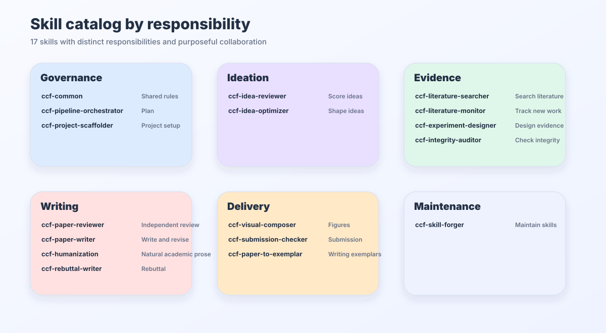
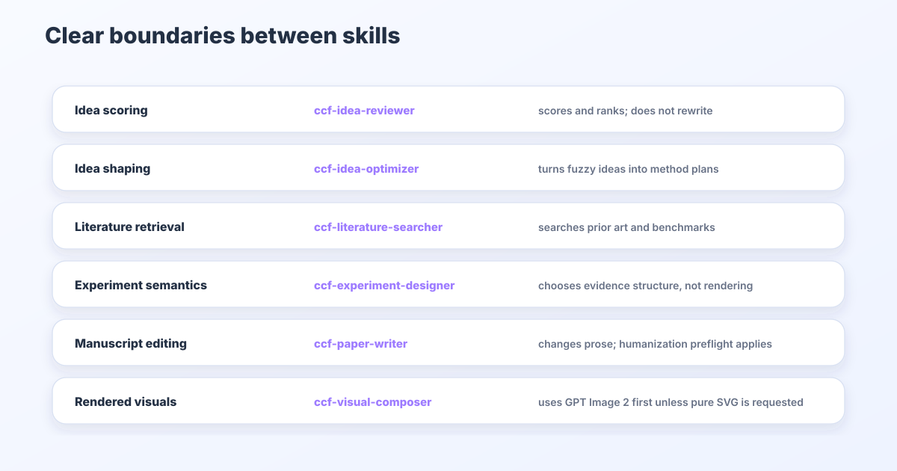

# CCFA Skills Catalog

This catalog is the public trigger-conflict index for the current CCFA family. If this document conflicts with a skill's `SKILL.md`, `SKILL.md` is authoritative.

## Runtime Skills

| Skill | Stage | Startup condition | 中文触发 | Included modes | Do not use for |
| --- | --- | --- | --- | --- | --- |
| `ccf-humanization` | First preflight | Activate before every CCFA skill; keep communication direct while preserving evidence and rigorous criticism. Detailed editing depends on scope. | 所有技能执行前优先启用；去防御性、保留真实证据与严谨判断。 | family-preflight, manuscript-humanization, experiment-humanization, warning-only | Concealing evidence, softening valid criticism, fabricating results, or rewriting without authorization. |
| `ccf-project-scaffolder` | Setup | Create project folders, copy/select templates, initialize `ccfa.yaml`. | 创建论文项目、复制模板、初始化 `ccfa.yaml`。 | scaffold | Research content generation. |
| `ccf-pipeline-orchestrator` | Planning | Plan workflow, decompose tasks, coordinate gates and handoffs. | 拆任务、排阶段、定 gate、决定下一个 owner。 | planning, status, gate | Writing, review, search, experiment design, rebuttal. |
| `ccf-idea-optimizer` | Idea | Explore, rescue, and turn rough directions into problem-gap-insight-method-evidence plans. | 优化粗 idea、具象化研究思路、找方向、救方向、形成 problem-gap-insight。 | exploratory idea shaping, rescue routes | Ranking multiple ideas as the main task. |
| `ccf-idea-reviewer` | Concept judgment | Assess research value, novelty, insight, and mechanism; experiments are outside default scope. | 思路审核、靠谱吗、值得做吗、创新够不够、评分排名；无需指定分数。 | concept review, scoring/ranking, stage-aware triage | Idea development, manuscript evidence review, or unsolicited experiment assessment. |
| `ccf-literature-monitor` | Monitoring | Track recent arXiv/OpenReview/venue papers, labs, competitors, and novelty-threat signals. | 竞品监控、新论文追踪、最近有没有类似 idea、arXiv/会议动态。 | arxiv-watch, venue-watch, novelty-check, trend-scouting, competitor-tracking | Deep related-work search, citation audit, or final idea scoring. |
| `ccf-literature-searcher` | Evidence | Search and screen literature, prior art, datasets, benchmarks, and opportunity gaps. | 检索相关工作、prior art、数据集、benchmark、方向调研、open gap。 | search, screening, opportunity map | Auditing only already cited papers or acting as a final idea kill gate. |
| `ccf-experiment-designer` | Evidence | Design experiments and build real-result tables/figures. | 设计实验、baseline、metric、消融、结果表和真实结果图。 | experiment design, result templates, result figures/tables | Inventing results or drawing CCFA docs diagrams. |
| `ccf-visual-composer` | Visual evidence | Compose publication-grade data figures/tables and scientific method/architecture diagrams; use GPT Image 2 as the default first-pass renderer, then complete requested editable SVG/PDF/PPTX reconstruction; use pure SVG first only on explicit opt-out. | 数据图表、方法/模型/系统架构图、科研绘图 prompt、默认 GPT Image 2 成图、按请求继续可编辑 SVG/PDF/PPTX 重建、明确拒绝时纯 SVG、caption、正文嵌入、视觉 QA。 | visual-contract, figure-design, architecture-generation, pure-svg-generation, editable-reconstruction, python-plotting, table-design, layout-integration, render-qa | Designing experiments, inventing results/components, writing manuscript prose as the main task, or final submission compliance. |
| `ccf-paper-to-exemplar` | Writing support | Convert paper PDFs into reusable writing exemplar cards for `ccf-paper-writer`. | 把论文 PDF 转成写作范例卡、建立个人 exemplar 库。 | exemplar extraction, style-pattern cards, custom exemplar registration | Writing papers or performing review. |
| `ccf-paper-writer` | Manuscript | Draft, revise, polish, compress, preserve source format during edits, create venue- and length-aware LaTeX manuscripts from ideas, and presentation-adapt paper text. | 写作、润色、压缩；保留原格式；只有 idea 时按目标会议 LaTeX 和篇幅预算起草；缺省回退 NeurIPS。 | draft, polish, compression, venue-aware LaTeX drafting, page-budget drafting, presentation | Full review, evidence audit, package check, rebuttal. |
| `ccf-paper-reviewer` | Review | Review manuscripts scientifically and stylistically. | 科学审稿、写作评审、格式风险、评分、AC/meta-review。 | scientific review, writing review, format-facing review | Rewriting manuscript text or drafting rebuttals. |
| `ccf-integrity-auditor` | Audit | Audit claims, numbers, figures/tables, citations, and BibTeX. | 审计 claim、数字、图表、引用、BibTeX 和上下文支撑。 | claim audit, numeric audit, citation audit | Full scientific review or broad literature search. |
| `ccf-submission-checker` | Submission | Check venue rules, LaTeX/PDF package, anonymity, metadata, artifacts. | 查会议格式、模板页数、匿名、PDF metadata、artifact/reproducibility。 | venue format, package check, artifact | Polishing manuscript content. |
| `ccf-rebuttal-writer` | Post-review | Write rebuttals, response letters, revision ledgers, resubmission plans. | 写 rebuttal、response letter、revision ledger、保守重投计划。 | rebuttal, ledger, response letter, resubmission | Ordinary manuscript writing. |
| `ccf-common` | Shared preflight | Activate after Humanization before every specialist; apply shared scope, routing, prerequisites, evidence, and artifact rules. | 所有技能执行前启用共享规则；兼顾家族规则维护。 | family-preflight, governance | Taking over research deliverables or running maintenance merely because it was activated. |
| `ccf-skill-forger` | Maintenance | Maintain skills, routing, docs, SVG diagrams, validation, and releases. | 维护 skills、路由、README、SVG、校验和 release。 | skill maintenance, docs/SVG maintenance | Research writing, review, or experiments. |

## Merged Entries

| Removed standalone skill | Current owner | Why |
| --- | --- | --- |
| `ccf-workflow-planner` | `ccf-pipeline-orchestrator` | Planning and orchestration are the same project-control layer. |
| `ccf-paper-compressor` | `ccf-paper-writer` | Compression changes manuscript text and must share writing safeguards. |
| `ccf-writing-reviewer` | `ccf-paper-reviewer` | Writing review is a review mode, not a separate runtime owner. |
| `ccf-citation-auditor` | `ccf-integrity-auditor` | Citation verification is evidence integrity. |
| `ccf-figure-table-builder` | `ccf-experiment-designer`, then `ccf-visual-composer` | Evidence/result content depends on real experiment values; publication visual composition, palette, caption placement, and render QA belong to visual composer. |
| `ccf-artifact-packager` | `ccf-submission-checker` | Artifact readiness is submission readiness. |
| `ccf-venue-format-guide` | `ccf-submission-checker` | Venue format lookup is a submission gate; writing still reads venue references. |
| `ccf-resubmission-adapter` | `ccf-rebuttal-writer` | Resubmission follows reviewer-response and revision-ledger logic. |
| `ccf-paper-presenter` | `ccf-paper-writer` | Slides/posters/talk scripts are paper-derived writing outputs. |
| `ccf-doc-diagram-designer` | `ccf-skill-forger` | Docs SVGs are repository maintenance. |

## Conflict Rules

- Non-review workflow skills should follow the user's requested output shape. Their internal checklists are safeguards, not mandatory visible report templates.
- Every CCFA skill receives `ccf-humanization` first and `ccf-common` second. Reuse applicable active rules across contributors without recursive startup. Detailed rewriting and experiment checks remain conditional; assessment-only work preserves the assessed artifact and rigorous criticism. Specialist ownership and explicit scope remain intact.
- Review, audit, and submission-gate skills may remain structured because their job is traceable diagnosis and pass/fail risk control.
- Full-workflow and full-paper prompts should produce dense artifacts, not route summaries. A manuscript request should leave a manuscript; a closed-loop request should leave idea review, writing draft, review, audit, rebuttal, and submission-check artifacts.
- Idea exploration, rescue, and shaping go to `ccf-idea-optimizer`; concept judgment, including natural questions without score wording, goes to `ccf-idea-reviewer`. Route by the requested judgment even when a full manuscript is supplied. Idea and paper reports use separate detailed review structures by default, with brief output on explicit request; only manuscript scientific review evaluates experiment completeness by default.
- Recent-paper watching, competitor tracking, and "is there a new similar idea?" go to `ccf-literature-monitor`; deep related-work discovery and opportunity mapping go to `ccf-literature-searcher`; existing citation verification goes to `ccf-integrity-auditor`.
- In early research, a weak or crowded direction should produce rescue routes, narrowing options, and evidence-to-decide before `abandon` is used.
- Manuscript rewriting, compression, and presentation outputs go to `ccf-paper-writer`; judgment goes to `ccf-paper-reviewer`.
- PDF-to-exemplar conversion goes to `ccf-paper-to-exemplar`; actual manuscript drafting still goes to `ccf-paper-writer`.
- From-scratch submission manuscripts must be length-aware: underfilled drafts stay with `ccf-paper-writer` for expansion; overfilled drafts stay with `ccf-paper-writer` for compression; final page compliance goes to `ccf-submission-checker`.
- Real result/evidence structure goes to `ccf-experiment-designer`; publication-grade data figures and research method/architecture diagrams, including GPT Image 2-first drafts and optional editable SVG/PDF/PPTX reconstruction, go to `ccf-visual-composer`; repository documentation diagrams go to `ccf-skill-forger`.
- Venue requirements, package checks, anonymity, and artifact readiness go to `ccf-submission-checker`.
- Reviewer responses, revision ledgers, and resubmission plans go to `ccf-rebuttal-writer`.

## Venue Guides

The legacy per-venue runtime layer remains reference-only:

- `ccf-paper-writer/references/venue-guides/index.md`
- `ccf-paper-writer/references/venue-guides/<venue>.md`

Use `ccf-paper-writer` for venue-aware manuscript text and `ccf-submission-checker` for venue/package compliance.

All file-producing modes follow the shared artifact contract: existing destinations first, stable task/artifact working directories, current-file updates, and preserved source evidence. A local visual update reuses its editable source and assets. Reference loading and checks are scoped to the current mode and affected dependencies; full requested scientific coverage is preserved.
