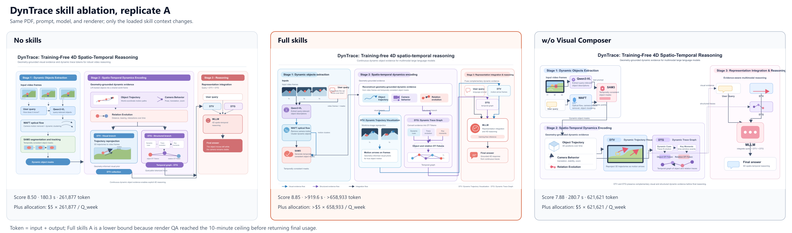
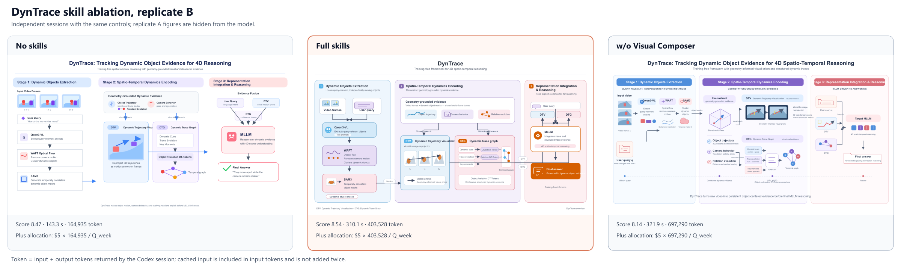
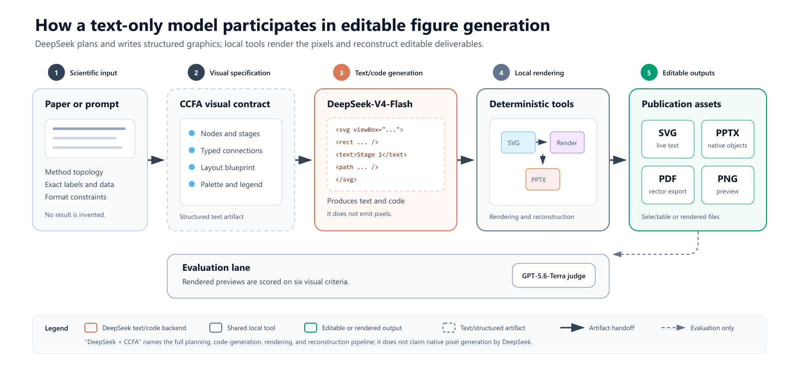
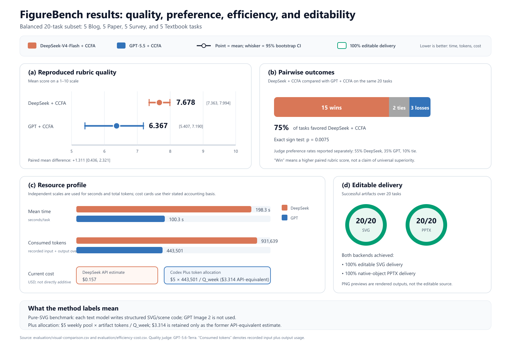
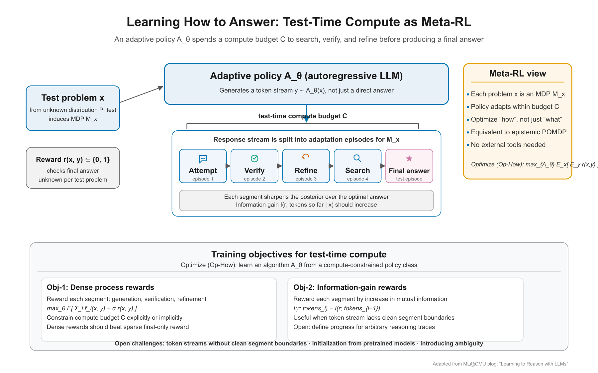
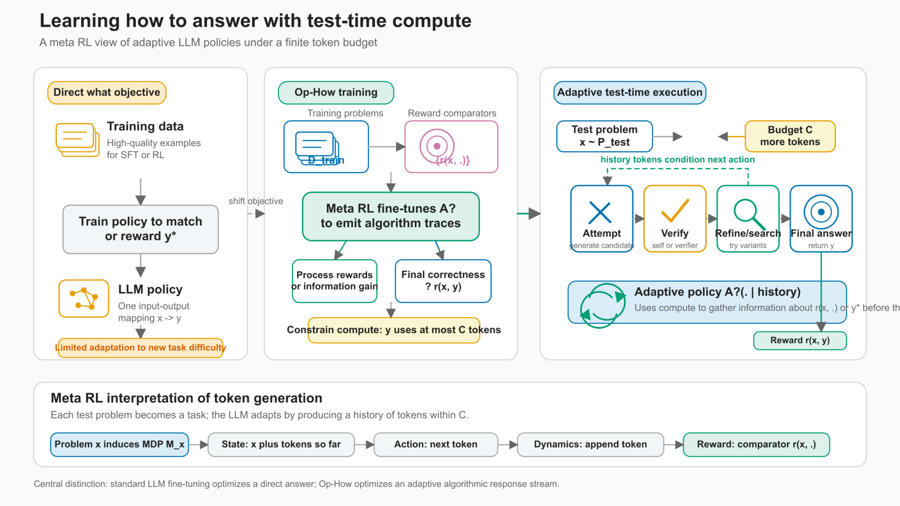
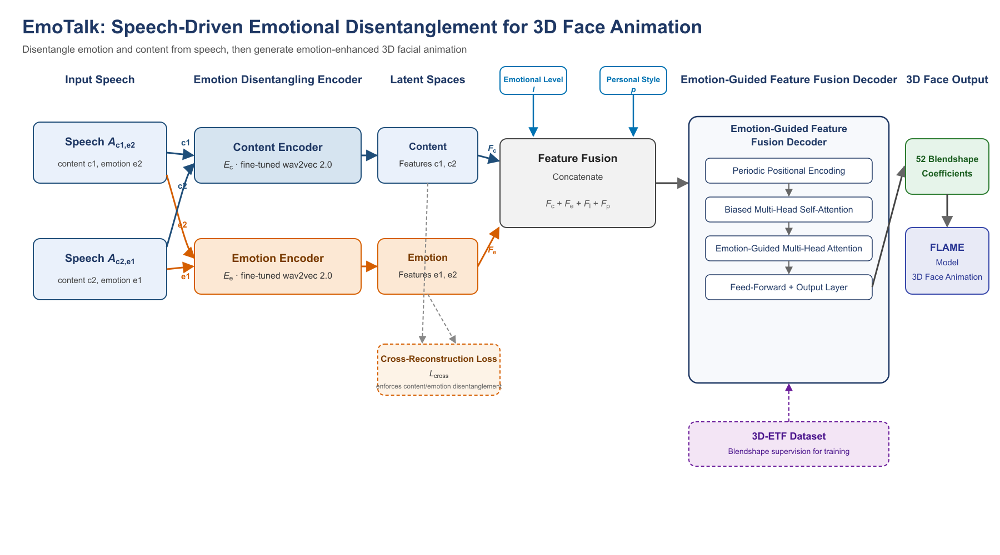
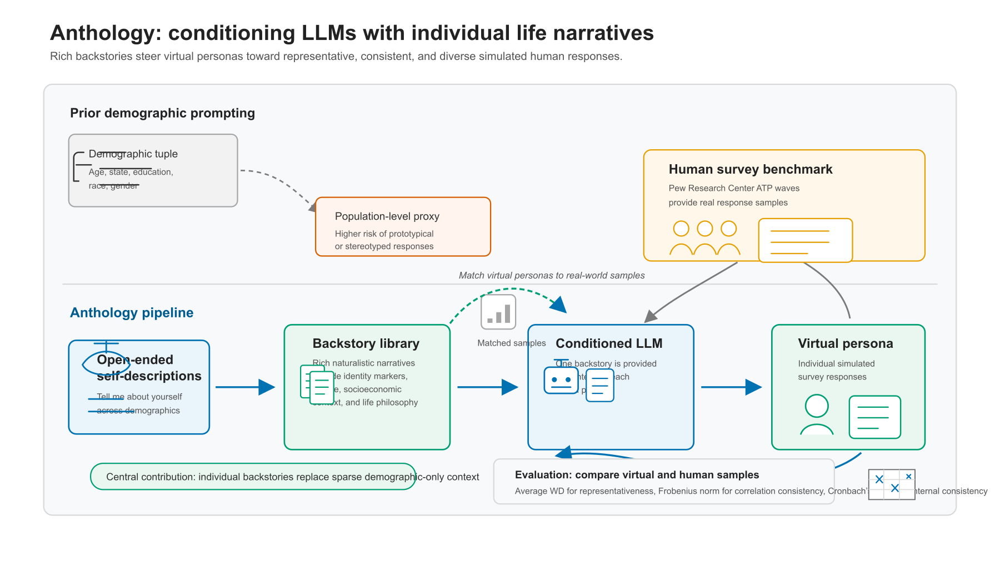

# CCFA Skills 实验结果

更新日期：2026-08-13
版本：v0.9.0

## 1. 实验协议

### 1.1 实验集合

| 实验 | 目的 | 样本与条件 | 数据文件 |
| --- | --- | --- | --- |
| Skill 条件消融 | 比较任务级路由、全家族注入、无 skill 与额外 Humanization 的质量和资源消耗 | 3 个模型；每个条件 50 个任务 | [condition-ablation.csv](evaluation/condition-ablation.csv) |
| DynTrace 绘图消融 | 评估 `ccf-visual-composer` 对论文方法架构图的贡献 | 同一 PDF、同一 prompt、同一模型；3 个条件 × 2 次复现 | [dyntrace-skill-ablation.csv](evaluation/dyntrace-skill-ablation.csv) |
| FigureBench 图形生成 | 比较不同文本模型作为纯 SVG 图形规划后端的质量与效率 | 20 个平衡样本；blog、paper、survey、textbook 各 5 个 | [visual-comparison.csv](evaluation/visual-comparison.csv) |
| 模型级回归 | 检查 CCFA 候选输出相对既有公开基线输出是否退化 | Idea 201 对/组；Writing 10 对/组 | [model-regression.csv](evaluation/model-regression.csv) |
| 资源统计 | 统一报告耗时、消耗 token 与成本 | 与上述实验逐项对应 | [efficiency-cost.csv](evaluation/efficiency-cost.csv) |

已清理失败尝试、重复 prompt、临时渲染目录和不可比较的公开榜单拼接。后续复现实验应覆盖同名 CSV 与图像路径，不新增重复过程目录。

### 1.2 质量评分

条件消融沿用原评测器的聚合质量分，仅用于同模型、同任务集合下的条件比较。DynTrace 图像采用六项 0 到 10 分 rubric：拓扑忠实度、标签准确性、阅读路径、机制表达、论文缩放可读性、适应性原创性。候选图匿名后由 GPT-5.6-Sol 评审两遍，第二遍反转候选顺序，最终分数取两遍均值。

FigureBench 质量分用于固定协议内的配对比较。均值差使用配对 bootstrap 置信区间，胜负使用 exact sign test。质量分表示 rubric 满足程度，不等同于可编辑交付成功率。

### 1.3 资源与成本

“消耗 token”指生成最终保留产物时记录的输入与输出总量；无法恢复分项时只报告总量。该指标表示运行消耗，不表示最终文件包含的 token 数。DeepSeek 成本按 API 输入与输出 token 单价加权。GPT/Codex 成本采用用户指定的 ChatGPT Plus 分摊口径：20 美元/月近似为 5 美元/周，单项分摊成本为 `5 美元 × 消耗 token / Q_week`，其中 `Q_week` 为账户当周总 token 额度。旧 API 等价估计仅保留在括号中，用于复现历史记录。

## 2. Skill 条件消融

Base 不加载 skill。Full Family 同时注入全部 skill 正文，是朴素全量加载基线。Task Skill 只加载任务 owner，是 CCFA 推荐执行方式。Task + Humanization 用于检验额外写作预处理，不是所有任务的默认配置。表中 token 为每个条件 50 个任务的平均输入加输出 token。

### 2.1 任务级路由相对全家族注入的 token 消耗

| 模型 | Full Family 质量 | Task Skill 质量 | 质量变化 | Full Family token/任务 | Task Skill token/任务 | 节省 token/任务 | 降幅 |
| --- | ---: | ---: | ---: | ---: | ---: | ---: | ---: |
| GPT-5.6-Terra | 0.9723 | **0.9749** | **+0.0026** | 55,030 | **50,705** | **4,325** | **7.9%** |
| DeepSeek-V4-Flash | 0.9622 | **0.9638** | **+0.0016** | 220,328 | **198,140** | **22,188** | **10.1%** |
| DeepSeek-V4-Pro | 0.9300 | **0.9514** | **+0.0214** | 218,890 | **195,928** | **22,963** | **10.5%** |

在三个模型上，Task Skill 同时取得更高质量和更低 token 消耗。该结论限定为 Task Skill 相对 Full Family 的比较；它不表示加载 skill 会比 Base 消耗更少原始 token。Base 上下文最短，因此 token 最少，但三个模型的 Base 质量均低于 Task Skill。

### 2.2 全部条件结果

| 模型 | 条件 | 质量 | 平均耗时/任务 | 平均消耗 token/任务 | 相对 Full Family token | 当前成本/任务 |
| --- | --- | ---: | ---: | ---: | ---: | ---: |
| GPT-5.6-Terra | Base | 0.9646 | **45.2 s** | **21,153** | −61.6% | `5 × 21,153 / Q_week` |
| GPT-5.6-Terra | Full Family | 0.9723 | 66.1 s | 55,030 | 基准 | `5 × 55,030 / Q_week` |
| GPT-5.6-Terra | **Task Skill** | **0.9749** | 66.6 s | 50,705 | **−7.9%** | `5 × 50,705 / Q_week` |
| GPT-5.6-Terra | Task + Humanization | 0.9716 | 65.1 s | 55,853 | +1.5% | `5 × 55,853 / Q_week` |
| DeepSeek-V4-Flash | Base | 0.9023 | **31.1 s** | **9,134** | −95.9% | **$0.0017** |
| DeepSeek-V4-Flash | Full Family | 0.9622 | 36.9 s | 220,328 | 基准 | $0.0049 |
| DeepSeek-V4-Flash | **Task Skill** | **0.9638** | 47.1 s | 198,140 | **−10.1%** | $0.0069 |
| DeepSeek-V4-Flash | Task + Humanization | 0.9334 | 40.8 s | 200,256 | −9.1% | $0.0069 |
| DeepSeek-V4-Pro | Base | 0.9187 | **40.3 s** | **8,273** | −96.2% | $0.0045 |
| DeepSeek-V4-Pro | Full Family | 0.9300 | 42.9 s | 218,890 | 基准 | $0.0057 |
| DeepSeek-V4-Pro | **Task Skill** | **0.9514** | 42.0 s | 195,928 | **−10.5%** | **$0.0053** |
| DeepSeek-V4-Pro | Task + Humanization | 0.9493 | 42.0 s | 198,877 | −9.1% | $0.0054 |

Task Skill 相对 Base 的质量增益分别为 0.0103、0.0615 和 0.0327。Full Family 未带来额外质量优势。Humanization 应用于论文写作、实验叙述和出版文本，不应无条件叠加到所有研究任务。

## 3. DynTrace 绘图消融

### 3.1 控制协议

三组条件均使用 `output/DynTrace.pdf`、用户给定的同一英文架构图 prompt、GPT-5.6-Terra、纯 SVG 代码生成和 Inkscape 渲染。该历史消融不调用 GPT Image 2，衡量的是 skill 对纯 SVG 规划、代码生成与渲染 QA 的贡献。这里的 Full skills 指绘图任务所需的 Humanization 与 Visual Composer 组合，不是第 2 节的 Full Family 全量注入。A、B 为独立复现。

| 复现 | 条件 | 质量 | 耗时 | 消耗 token | 当前成本 | 状态 |
| --- | --- | ---: | ---: | ---: | ---: | --- |
| A | No skills | 8.500 | 180.3 s | 261,877 | `5 × 261,877 / Q_week` | 完成 |
| A | **Full skills** | **8.850** | >919.6 s | >658,933 | `>5 × 658,933 / Q_week` | Render-QA 超时；效率为下界 |
| A | w/o Visual Composer | 7.875 | 280.7 s | 621,621 | `5 × 621,621 / Q_week` | 完成 |
| B | No skills | 8.465 | **143.3 s** | **164,935** | `5 × 164,935 / Q_week` | 完成 |
| B | **Full skills** | **8.535** | 310.1 s | 403,528 | `5 × 403,528 / Q_week` | 完成 |
| B | w/o Visual Composer | 8.135 | 321.9 s | 697,290 | `5 × 697,290 / Q_week` | 完成 |

| 条件 | 平均质量 | 平均耗时/次 | 平均消耗 token/次 | 相对 No skills token | 当前成本/次 |
| --- | ---: | ---: | ---: | ---: | ---: |
| No skills | 8.483 | **161.8 s** | **213,406** | 基准 | `5 × 213,406 / Q_week` |
| **Full skills** | **8.693** | >614.8 s | >531,231 | >+148.9% | `>5 × 531,231 / Q_week` |
| w/o Visual Composer | 8.005 | 301.3 s | 659,456 | +209.0% | `5 × 659,456 / Q_week` |

Full skills 在两次复现中均取得最高质量，平均质量比 No skills 高 0.210，比 w/o Visual Composer 高 0.688。No skills 的耗时和 token 最低。该实验支持绘图 skill 的质量贡献，不支持“绘图 skill 比 No skills 更省 token”的结论。

### 3.2 复现 A

图 1：复现 A 的三条件成图。每个面板使用相同论文输入和相同绘图 prompt。

### 3.3 复现 B

图 2：复现 B 的三条件成图。独立会话用于检查结论是否依赖单次随机输出。

## 4. FigureBench 图形生成对比

### 4.1 后端定义

DeepSeek 是纯文本模型。本实验中，DeepSeek 生成结构化 SVG 或场景代码，本地渲染器将代码转换为 PNG，并进一步交付可编辑 SVG 与 native-object PPTX。因此，“DeepSeek 生成图”表示其完成图形规划与代码生成，不表示模型原生输出像素。

图 3：文本模型到可编辑科研图的链路。模型输出与本地渲染职责在图中分离标注。

### 4.2 二十样本聚合结果

本节全部结果来自纯 SVG 生成链路：文本模型直接规划并输出 SVG 或场景代码，本地工具渲染 PNG，并从语义结构交付 SVG/PPTX。该实验未调用 GPT Image 2，因此只评估纯 SVG 代码生成后端，不代表新版 Visual Composer 默认 GPT Image 2-first 成图质量。

| 图形规划与代码后端 | n | 平均质量 | 95% CI | Judge 偏好率 | 平均耗时/任务 | 总消耗 token | token/任务 | 当前成本 | SVG/PPTX |
| --- | ---: | ---: | ---: | ---: | ---: | ---: | ---: | ---: | ---: |
| **DeepSeek-V4-Flash + CCFA** | 20 | **7.678** | [7.363, 7.994] | **55%** | 198.3 s | 931,639 | 46,582 | $0.157 API | 100%/100% |
| GPT-5.5 + CCFA | 20 | 6.367 | [5.407, 7.190] | 35% | **100.3 s** | **443,501** | **22,175** | `5 × 443,501 / Q_week`（旧 API 等价 $3.314） | 100%/100% |

配对质量差为 1.311，95% bootstrap CI 为 [0.436, 2.321]。DeepSeek 后端取得 15 胜、2 平、3 负，exact sign test `p=0.0075`。在该 20 样本协议下，DeepSeek 后端质量更高；GPT 后端平均快 98.0 秒，且每任务 token 消耗降低 52.4%。该结果比较同一纯 SVG skill 路由下的模型后端差异，不是 skill 与 no-skill 的消融。

图 4：FigureBench 的质量、配对胜负、效率、成本口径和可编辑交付率。误差线表示 95% bootstrap CI。

### 4.3 实际成图样例

本节展示模型直接生成 SVG/场景代码并由本地渲染器输出的像素产物。它们不是 GPT Image 2 成图、参考图、人工重绘或仅由分数推断的示意图。

**同题直接对照。** 两个后端均处理 FigureBench `figurebench-000-blog`，输入文本、CCFA 路由和渲染链一致。该组来自正式批量实验前的流水线实跑，不并入 20 样本聚合统计。

| DeepSeek-V4-Flash + CCFA | GPT-5.5 + CCFA |
| --- | --- |
|  |  |
| 179.3 s；46,751 token；单题成本记录不可恢复 | 单题效率记录已清理；不以聚合均值替代 |

图 5：FigureBench `figurebench-000-blog` 的同题双后端成图。两图均围绕 test-time compute 与 Meta-RL 组织信息。

**代表性成图。** 两张图的原任务标识未随像素产物保留，按可见主题标识为 EmoTalk 与 Anthology。两者输入不同，仅用于定性展示排版与机制表达形态，不用于逐题胜负或模型差值计算。

| DeepSeek-V4-Flash + CCFA：EmoTalk | GPT-5.5 + CCFA：Anthology |
| --- | --- |
|  |  |
| EmoTalk 方法架构图：双编码器、潜空间、特征融合与 3D 面部输出 | Anthology 方法图：人口学提示与个体叙事管线的对照结构 |

图 6：代表性实际成图。该组提供定性审阅材料，不改变配对统计结论。

## 5. 模型级回归

Idea 回归使用固定 pairwise judge 协议，将 CCFA 候选输出与既有 DeepSeek-R1、o4-mini 基线输出比较。Writing 回归使用 Claude-3.7-Sonnet、Gemini-2.5-Pro 和 o4-mini 的既有输出。

| 维度 | Judge | CCFA 候选 | 基线 | 任务数 | 胜/平/负 | 不一致 | 总任务胜率 |
| --- | --- | --- | --- | ---: | ---: | ---: | ---: |
| Idea | DeepSeek-V4-Flash | GPT-5.5 + CCFA | DeepSeek-R1 | 201 | 194/0/0 | 7 | 96.52% |
| Idea | DeepSeek-V4-Flash | GPT-5.5 + CCFA | o4-mini | 201 | 146/1/8 | 46 | 72.64% |
| Idea | GPT-5.5 | DeepSeek-V4-Flash + CCFA | DeepSeek-R1 | 201 | 196/0/2 | 3 | 97.51% |
| Idea | GPT-5.5 | DeepSeek-V4-Flash + CCFA | o4-mini | 201 | 174/0/15 | 12 | 86.57% |
| Writing | DeepSeek-V4-Flash | GPT-5.5 + CCFA | Claude-3.7-Sonnet | 10 | 9/0/0 | 1 | 90% |
| Writing | DeepSeek-V4-Flash | GPT-5.5 + CCFA | Gemini-2.5-Pro | 10 | 9/0/0 | 1 | 90% |
| Writing | DeepSeek-V4-Flash | GPT-5.5 + CCFA | o4-mini | 10 | 10/0/0 | 0 | 100% |
| Writing | GPT-5.5 | DeepSeek-V4-Flash + CCFA | Claude-3.7-Sonnet | 10 | 10/0/0 | 0 | 100% |
| Writing | GPT-5.5 | DeepSeek-V4-Flash + CCFA | Gemini-2.5-Pro | 10 | 9/0/0 | 1 | 90% |
| Writing | GPT-5.5 | DeepSeek-V4-Flash + CCFA | o4-mini | 10 | 9/0/0 | 1 | 90% |

Idea 结果显示强回归表现。Writing 每组仅 10 个样本，适合发现明显退化，不足以独立支持广义 SOTA 结论。

| 维度 | Judge | Jobs | 平均耗时/Job | 总消耗 token | token/Job | 当前成本 |
| --- | --- | ---: | ---: | ---: | ---: | ---: |
| Idea | DeepSeek-V4-Flash | 804 | **20.3 s** | **2,387,002** | **2,969** | $0.455 API |
| Idea | GPT-5.5 | 804 | 54.4 s | 11,325,484 | 14,086 | `5 × 11,325,484 / Q_week`（旧 API 等价 $27.915） |
| Writing | DeepSeek-V4-Flash | 60 | **31.3 s** | 2,348,893 | 39,148 | $0.193 API |
| Writing | GPT-5.5 | 60 | 63.0 s | **1,767,219** | **29,454** | `5 × 1,767,219 / Q_week`（旧 API 等价 $7.492） |

该表为 judge 后端资源统计，不改变第 2.1 节关于 skill 路由 token 节省的结论。

## 6. Skill 家族冗余与冲突审计

当前运行面包含 17 个 `ccf-*` skills。审计未发现可在不损失独立职责、触发语义或产物契约的情况下安全删除的运行时 skill，因此本轮未删除 skill。已固定的关键边界包括：Monitor 负责持续增量监控，Searcher 负责面向具体问题的深检索；Paper-to-Exemplar 负责将 PDF 蒸馏为写作卡，Paper Writer 消费写作卡并撰写正文；Experiment Designer 负责数据、协议和证据含义，Visual Composer 负责构图、图标、渲染和可编辑重建；Common 维护共享治理，Skill Forger 维护技能与发布资产。

历史上 10 个独立 helper 已合并到现有 owner，包括 paper compressor、writing reviewer、citation auditor、figure/table builder 和 artifact packager。它们不应重新安装为并行 skill。

## 7. 参考布局控制功能核验

视觉 skill 中最初用于“模仿”的可控成图功能仍然存在，当前实现方式为 reference-guided layout control。该功能位于 `ccf-visual-composer` 的 `reference-layout-blueprint` 模式，并由 `references/reference-layout-blueprint.md` 和 `references/adaptive-architecture-style.md` 支撑。其流程为：优先使用用户提供的参考，其次使用公开论文图或公开设计案例；从参考中提取阅读路径、层级锚点、网格、对齐、间距节奏、分组方式和连接线组织；随后生成与当前方法拓扑匹配的低保真布局蓝图，再进入 GPT Image 2 或纯 SVG 生成。

该功能未被稀释，但术语从“模仿”调整为“参考驱动的构图控制”。原因是科研图生成需要可控性，同时必须避免复制参考图的节点位置、图标集、专有配色、标签、装饰签名或截图模板。当前规则保留可迁移构图原则，禁止直接复刻具体图形外观。

## 8. 实验结论

Task Skill 是当前最稳定的执行配置。在三个模型的 50 任务消融中，Task Skill 相对 Full Family 同时提高质量并减少 7.9% 到 10.5% 的 token 消耗。该结果证明按任务 owner 加载优于全家族注入。

Visual Composer 在 DynTrace 纯 SVG 消融中取得最高平均质量，说明绘图 skill 对架构图质量有正贡献；其代价是更高耗时和更高 token 消耗。FigureBench 表明模型后端存在质量与效率权衡：DeepSeek-V4-Flash 在 20 样本纯 SVG 协议下质量更高，GPT-5.5 更快且 token 更少。模型级回归未发现相对所选基线的系统性退化。

上述结论均受实验协议约束。DynTrace 仅有两次复现；视觉 judge 与候选模型存在同族风险；FigureBench 的 GPT Image 2-first 路径尚未在同一 20 样本协议下重测。因此，本文档只给出受控实验内的优势结论，不扩展为未验证的普遍 SOTA 声明。
