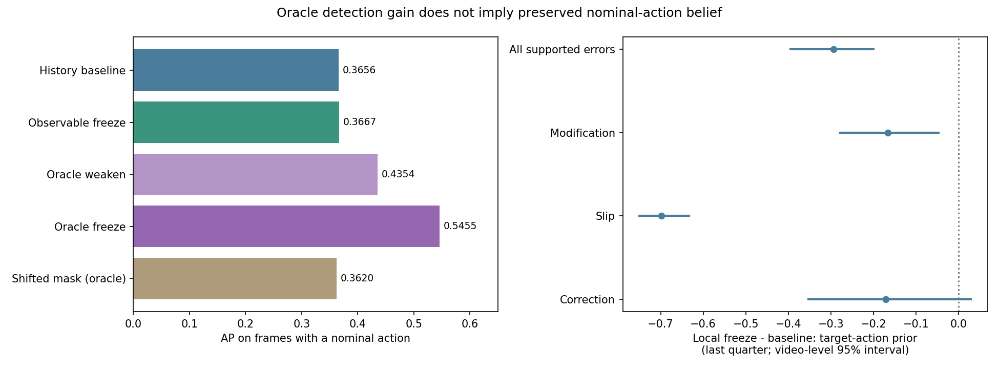

# Tea：错误区间的信念更新干预验证

**验证结论：本轮没有支持“屏蔽错误视觉能保住正确动作信念”这一总体解释。真实错误掩码带来了较大的检测 AP 增益，但从相同事件起点出发，屏蔽视觉更新使名义正确动作的信念下降。两种指标指向不同机制，不能把 oracle 的 AP 增益当成实际方法收益。**

## 验证设计

所有新增文件位于本目录。26 个正常训练视频拟合的特征库、动作中心、历史转移矩阵及正常验证选出的温度 0.15/观测强度 0.1 均继承上一轮，未重新拟合或根据本轮测试结果调参。验证仍为 3 个正常视频，测试为 35 个视频。主诊断子集为 45,596 个有正常动作对应帧。

在时间 t，历史模型先输出读取当前视觉之前的动作先验，再更新隐状态。屏蔽操作只取消当前视觉似然的乘入；状态转移继续推进。它不是把整个状态冻结在原地。

| 分支 | 更新方式 | 是否使用真实错误标签 |
|---|---|---|
| 原历史软条件 | 每帧正常更新 | 否 |
| 可观测分数触发屏蔽 | 当前全局最近邻分数超过已有正常验证阈值时，跳过视觉更新 | 否 |
| Oracle 全错误屏蔽 | 所有非 Normal 帧跳过视觉更新 | 是，仅诊断 |
| Oracle 弱化 | 错误帧的观测强度变为原值的 25% | 是，仅诊断 |
| Oracle 保留 Correction | 仅屏蔽 Modification、Slip、Addition，Correction 正常更新 | 是，仅诊断 |
| 平移掩码对照 | 将每个视频的错误掩码循环平移半个视频，保留屏蔽总帧数 | 是，仅诊断 |
| 真实动作参照 | 用真实名义动作选参考库，不是更新干预 | 是，仅诊断 |

实际分支的预测函数只接收特征、模型参数及固定阈值，不接收动作或错误标签。真实标签在实际预测完成后才进入独立的 oracle 分支和评测。平移掩码不是无标签方法，也不能保证与真实错误区间完全不重叠。

完整视频干预观察累计影响；事件局部干预则从原模型在事件开始前的同一隐状态出发，比较该事件内正常、25% 弱化、屏蔽三种更新。局部分支没有重置成真实正确状态，亦没有把真实动作作为模型输入，只在计算目标动作信念时使用标注。

## 完整视频检测结果

| 方法 | 主诊断子集 AP | 全测试 AP | 事件 F1 | 正常误报/分钟 |
|---|---:|---:|---:|---:|
| 全局最近邻 | 0.3591 | 0.5251 | 0.2251 | 0.872 |
| 原历史软条件 | 0.3656 | 0.5366 | 0.2105 | 1.094 |
| 可观测分数触发屏蔽 | 0.3667 | 0.5369 | 0.2132 | 1.163 |
| Oracle：全部错误屏蔽 | 0.5455 | 0.6743 | 0.2492 | 1.094 |
| Oracle：错误更新降至 25% | 0.4354 | 0.5933 | 0.2286 | 1.077 |
| Oracle：保留 Correction 更新 | 0.4872 | 0.6319 | 0.2483 | 1.111 |
| Oracle 对照：平移错误掩码 | 0.3620 | 0.5286 | 0.2057 | 1.265 |
| Oracle：真实动作参照 | 0.4485 | 0.5654 | 0.2770 | 1.009 |

Oracle 分支在全正常验证视频上等同原模型，因此其检测阈值与原模型完全相同；可观测分支使用相同 99% 正常分位规则计算自己的阈值。所有阈值在测试评分前保存。事件指标沿用上一轮 tIoU≥0.1 一对一匹配；这些不是相同测试误报率下的比较。

| 比较 | ΔAP | 配对视频 Bootstrap 95% 区间 |
|---|---:|---:|
| Oracle：全部错误屏蔽 − 原历史软条件 | +0.1799 | [+0.1388, +0.2110] |
| Oracle：错误更新降至 25% − 原历史软条件 | +0.0698 | [+0.0583, +0.0810] |
| Oracle：保留 Correction 更新 − 原历史软条件 | +0.1215 | [+0.0986, +0.1446] |
| 可观测分数触发屏蔽 − 原历史软条件 | +0.0010 | [+0.0002, +0.0021] |
| Oracle：全部错误屏蔽 − Oracle 对照：平移错误掩码 | +0.1835 | [+0.1485, +0.2119] |

Oracle 全屏蔽 AP 超过真实动作参照 AP，也不矛盾：两者使用的特权信息不同，真实动作参照不是严格上界。Oracle 掩码已经告知模型错误位置，干预将这些位置的信息注入后续评分。平移掩码较弱只能说明位置相关性重要，不能证明正确语义信念得到了保留。

可观测策略的 ΔAP 约为 +0.0010，区间在当前重复使用的测试样本上略高于零，但绝对收益很小，正常误报频率还从约 1.094 升至 1.163 次/分钟。它没有实现 oracle 的增益。

## 从相同起点出发的局部信念验证

分析 84 个有正常动作对应的错误事件：Modification 36、Slip 24、Correction 24。Addition 没有合法正常动作类，未计入该信念分析，但仍保留在完整视频检测中。衡量每个事件最后四分之一内“名义正确动作先验概率”的均值。先对每个视频中的事件取均值，再对视频取均值，避免长视频和长事件占据过大权重。

| 类别 | 事件数 | 屏蔽 − 正常更新：末段概率差 | 视频 Bootstrap 95% 区间 |
|---|---:|---:|---:|
| all_supported | 84 | -0.294 | [-0.395, -0.200] |
| Error_Modification | 36 | -0.166 | [-0.278, -0.047] |
| Error_Slip | 24 | -0.698 | [-0.750, -0.634] |
| Error_Correction | 24 | -0.170 | [-0.353, +0.029] |

尤其在 Slip 事件中，正常视觉更新有助于识别名义动作，而屏蔽会丢掉这种信息。检测 AP 增加与正确动作信念下降同时出现，不支持将前者解释成后者改善。Correction 的区间跨零，因此不对该类型作总体有害/有益判定。

下面列出每次观测更新后相对更新前的名义动作概率变化，以及局部屏蔽出现正收益的事件数。该分析不等同于真实动作正确执行与否；视频可能仍在做同一动作，只是对象、参数或结果有误。

| 类别 | 单次观测 Δ概率（逐帧均值） | 局部屏蔽末段概率改善事件/总事件 |
|---|---:|---:|
| Error_Correction | +0.0032 | 12/24 |
| Error_Modification | +0.0020 | 13/36 |
| Error_Slip | +0.0100 | 0/24 |
| Normal | +0.0110 | 不适用 |

全部信念干预是模型内部的计算对照，不是物理环境因果实验。名义动作标签也是有限代理，不能据此宣称正确程序进度或对象状态已经被识别。

## 可观测触发器覆盖了什么

| 标注类型 | 被可观测策略屏蔽的帧比例 |
|---|---:|
| Error_Addition | 44.72% |
| Error_Correction | 10.01% |
| Error_Modification | 3.19% |
| Error_Slip | 5.64% |
| Normal | 0.82% |

当前触发器主要覆盖 Addition，Modification 和 Slip 覆盖较少。简单依赖已有异常分数触发冻结，既缺少对这些错误的识别能力，也没有解决“同动作却执行错误”的判别问题。

## 可视检查



选取 Modification、Slip 中与该类局部概率差中位数最接近的事件，以及一个最大正向个例，展示平均结论之外的差异。上图局部分支均从相同原模型状态出发；下图为完整视频滚动干预的分数，两种起始条件不同，不应逐点当成同一干预。

- [nearest_type_median / Error_Modification](figures/local_case_01.png)：tea_u1_a4_error_029，128.3–140.2s，Stir using knife，局部屏蔽末段概率差 -0.140。
- [nearest_type_median / Error_Slip](figures/local_case_02.png)：tea_u1_a4_error_030，49.6–60.6s，Pour water into another mug，局部屏蔽末段概率差 -0.765。
- [largest_local_positive_example / Error_Correction](figures/local_case_03.png)：tea_u1_a1_error_024，59.8–67.5s，Move tea bag to new mug，局部屏蔽末段概率差 +0.478。

## 决策

**这项验证已完成；不建议把“冻结错误视觉以保护正确历史判断”作为目前的主方法叙事。** 当前证据更符合：错误视频仍含有识别动作类别的有用视觉信息，单靠动作类别/正常特征距离不足以区分执行是否正确；使用真实错误掩码进行屏蔽会改变评分，却不保证改善语义信念。

下一步应把动作身份与执行正确性分开检验。具体可先利用上一轮已发现的同动作 Slip 漏检，检查目标对象、对象间关系及动作前后状态是否能提供额外可区分信息；以动作标签正确但仍漏检的片段作为明确诊断集合。物体关系或状态信号若可用，再设计实际可观测的执行核验机制，而不是继续用当前异常分数给同一模型加门控。

这只是有证据支持的收窄方向，尚未验证对象/关系方法有效。继续实现前需要盘点对应原视频与对象标注的覆盖，并对照 AEM、GTG2Vid 等最近工作明确差异。

## 复现与证据边界

```powershell
python experiments/tea_belief_intervention_20260911/run_intervention.py
python experiments/tea_belief_intervention_20260911/analyze.py
```

- 配置：[protocol.json](protocol.json)；固定模型和划分出处：[frozen_inputs.json](outputs/frozen_inputs.json)。
- 检测结果和区间：[summary.json](outputs/summary.json)；局部事件数据：[event_local_metrics.json](outputs/event_local_metrics.json)；单步更新：[direct_observation_updates.json](outputs/direct_observation_updates.json)；触发器覆盖：[gate_coverage.json](outputs/gate_coverage.json)。
- 原始预测与信念在 `outputs/predictions/`；同起点局部轨迹在 `outputs/event_local_traces/`；逐事件命中和延迟继续保存于 `outputs/events.json`。
- 检查通过：[checks.json](outputs/checks.json)，覆盖旧评分和先验复现、正常验证下 oracle 不变、只屏蔽观测而保持转移、当前掩码不改变当前评分先验、可观测分支前缀一致性、局部分支共同起点与基线等价、平移掩码等帧数。
- Bootstrap 为 300 次视频级配对重采样。当前测试集已反复用于探索，区间不能消除选择偏差或支持跨任务结论；未进行多重比较校正。
- 256 维特征的精确提取窗口尚未核实，算法评分具有前缀因果性，但不能宣称端到端在线性能。标签沿用 refined_label_v3，Correction 仍计入主检测正类。
- 所有新文件均在当前目录，旧代码、旧结果与数据没有改动。评测代码是前轮函数的本地快照，只向当前目录写入。
